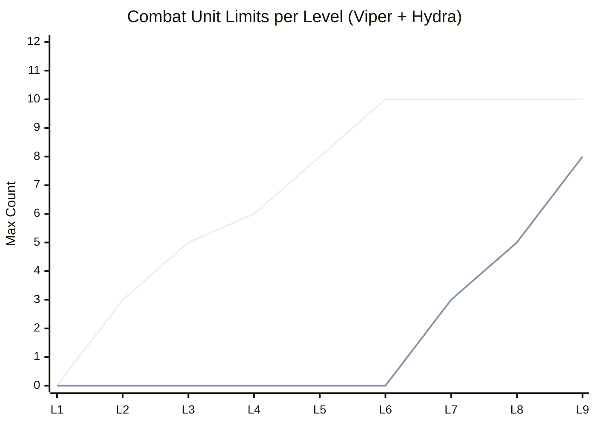
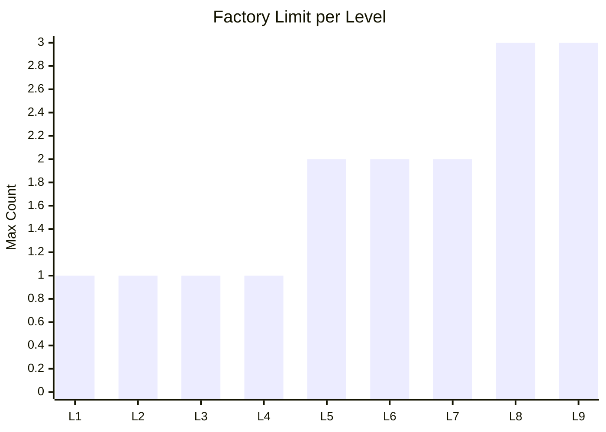
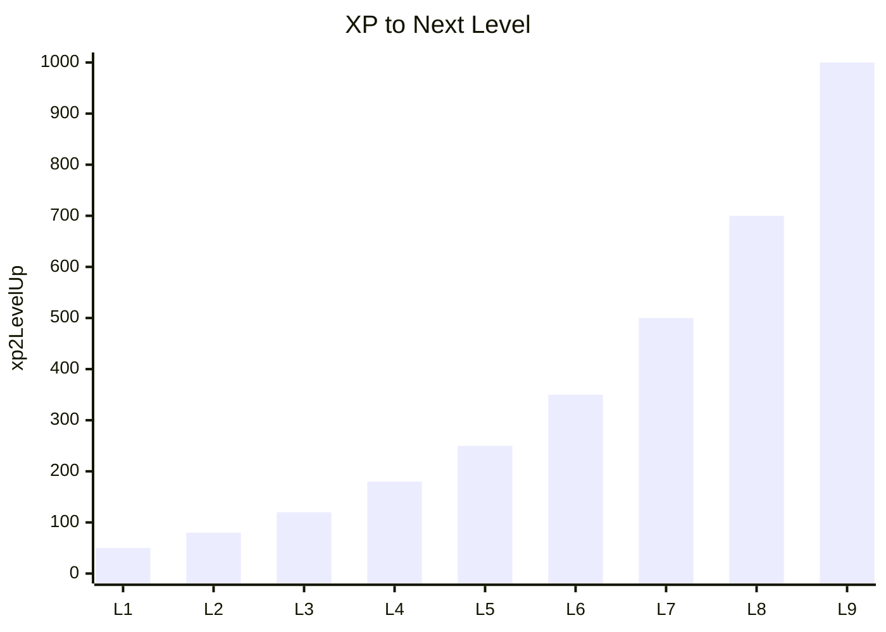
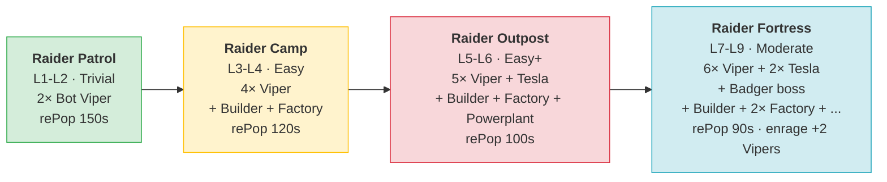
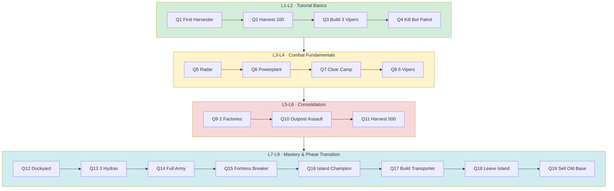
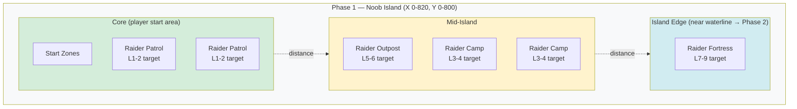

# Phase 1 Plan: Noob Island

> **Status:** Planning document. Source of truth for Phase 1 levels, units, bots, and quests.
> Live migration (razarion.com) happens iteratively, level by level.
>
> **Related documents:** [`progression.md`](progression.md) — strategic multi-phase overview.

---

## 1. Concept & Pacing

**Phase 1 region:** Noob Island, bottom-left of Planet 1
- Coordinates: X 0-820, Y 0-800 (~0.66 km²)
- Bounded by lake/water; Phase 2 lies across the water

**Gameplay identity:** Safe tutorial area. Bots do not attack on their own — they only fight back when attacked. Resources are abundant.

**Duration:** 9 levels. An engaged player reaches Level 9 in 30-60 minutes of play.

**Emotional arc per level block:**

| Block | Player feeling |
|---|---|
| L1-L2 | "I'm learning how the game works" |
| L3-L4 | "I can fight and defend myself" |
| L5-L6 | "I have a real army" |
| L7-L9 | "I've mastered the island and I'm ready for Phase 2" |

**Phase 1 → Phase 2 transition:**
At Level 9 the player unlocks the **Transporter** — a water-borne unit that ferries a Builder across the lake into the Phase 2 region. A follow-up quest then asks the player to sell the old base (gives Razarion as starting capital for Phase 2 + frees the island slot for new players).

---

## 2. Available Units & Buildings

All units available in Phase 1 (Live IDs from `base_item_type`).

**Glossary:**
- **DPS** = `weapon.damage / weapon.reloadTime` (sustained damage per second).
- **Buildup** = total work needed to construct this item (`baseItemType.buildup`).
- **Progress** = work produced per second by a Builder or Factory (`builderType.progress` / `factoryType.progress`).
- **Build time** = `target.buildup / producer.progress` seconds. With every producer at progress=1 today, build time in seconds equals the buildup value.

**HP / damage / cost values are the Phase 1 *target* (post-rebalance). See §2.1 (combat / HP) and §2.2 (cost) for derivation. Live values much higher — see §7.1 for the gap.** Buildup, speed, range, and progress are unchanged from Live for now (later balancing steps).

| ID | Name | Role | Cost | HP | Speed | DPS | Range | Buildup | Progress | Unlock |
|---|---|---|---|---|---|---|---|---|---|---|
| 1 | Builder | Construction | 50 | 20 | 12 | – | – | 40 | 1 (builds buildings) | L1 (start) |
| 2 | Harvester | Razarion collection | 25 | 12 | 14 | – | – | 7 | 2 (harvest/sec) | L1 |
| 4 | Factory | Builds Builder/Harvester/Viper | 35 | 40 | – | – | – | 8 | 1 (builds units) | L1 |
| 3 | Viper | Standard combat unit | 10 | 10 | 17 | 5 | 10 | 5 | – | L2 |
| 6 | Radar | Enables minimap | 35 | 30 | – | – | – | 15 | – | L3 |
| 7 | Powerplant | Power supply (for Radar) | 35 | 30 | – | – | – | 15 | – | L3 |
| 11 | Dockyard | Builds Hydra/Transporter (water) | 35 | 40 | – | – | – | 13 | 1 (builds water units) | L7 |
| 12 | Hydra | Water combat unit | 15 | 12 | 10 | TBD | 15 | 6 | – | L7 |
| 18 | Transporter | Carries Builder across water | 15 | 8 | 7 | – | – | 10 | – | L9 |

Player starts with 1 Builder and **100 Razarion** (down from Live's 1200 — see §2.2).

**Notes:**
- No static defense and no House in Phase 1 — player relies entirely on the mobile Viper/Hydra army.
- Hydra/Dockyard are water units — give Phase 1 a second front (lake control) in late levels.
- Transporter exists as the Phase 1 → 2 transition mechanic.
- Player house space is fixed at planet-base value (16) for all of Phase 1 — see §3 for army-size implications.
- Hydra damage / DPS is **TBD** — pending the bot-aggressor balancing step. Live value 12 placeholder until then.

### 2.1 HP & Damage Anchor

The Phase 1 numbers are derived from two combat anchors that lock everything else:

**Anchor 1 — Viper kills (Bot) Refinery in 3 shots:**
- Viper damage = 5, Refinery HP = 15 → 5 + 5 + 5 = 15 ✓

**Anchor 2 — 2 Vipers needed to kill 1 (Bot) Tesla:**
- Constraint: `Viper.HP × Viper.DPS  <  Tesla.HP × Tesla.DPS  <  3 × Viper.HP × Viper.DPS`
- Locked: Viper 10 HP / 5 DPS · Tesla 30 HP / 3 DPS (damage 6, reload 2)
- 1v1: Viper dies in 3.33s, Tesla in 6s → Tesla wins decisively
- 2v1: Tesla dies in 3s; first Viper takes 9 damage and survives at 1/10 HP — both Vipers alive

**Principle — building HP > vehicle HP:** Every building has more HP than every vehicle. Smallest building (House 25) > biggest vehicle (Builder 20).

**HP layer (Step 1, locked):**

| Type | Vehicle | HP | | Building | HP |
|---|---|---|---|---|---|
| | Transporter | 8 | | House | 25 |
| | Viper *(anchor)* | 10 | | Powerplant | 30 |
| | Harvester | 12 | | Radar | 30 |
| | Hydra | 12 | | Tower | 35 |
| | Builder | 20 | | Factory | 40 |
| | | | | Dockyard | 40 |

Bot reference (locked): (Bot) Refinery 15, (Bot) Refinery 2 15, (Bot) Tesla 30. Other bot units rescaled in the bot-aggressor step.

**Damage layer (Step 1, partially locked):**
- Viper: damage 5, reload 1.0, DPS 5 ✓
- (Bot) Tesla: damage 6, reload 2.0, DPS 3 ✓
- Hydra, (Bot) Viper, (Bot) Hydra, (Bot) Badger: TBD

**Demolition times (Viper alone vs static target, no return fire):**

| Target | HP | Time @ DPS 5 |
|---|---|---|
| Refinery / Refinery 2 | 15 | 3.0 s |
| House | 25 | 5.0 s |
| Powerplant / Radar / (Bot) Tesla | 30 | 6.0 s |
| Tower | 35 | 7.0 s |
| Factory / Dockyard | 40 | 8.0 s |

A Viper trio razes a full bot outpost (3× Refinery + 1× Tesla ≈ 75 HP) in ~5 seconds of focused fire — appropriate tutorial pacing.

### 2.2 Cost Anchor

Anchor: **Viper = 10 Razarion**. All costs scale relative to Viper, with the building / vehicle hierarchy preserved from Live.

**Cost layer (Step 1, locked):**

| Item | Live | Target | × Viper | Live factor |
|---|---|---|---|---|
| Viper *(anchor)* | 60 | **10** | 1.0 | ÷6 |
| Hydra | 70 | **15** | 1.5 | ÷4.7 |
| Transporter | 100 | **15** | 1.5 | ÷6.7 |
| Harvester | 150 | **25** | 2.5 | ÷6 |
| Factory | 200 | **35** | 3.5 | ÷5.7 |
| Radar | 200 | **35** | 3.5 | ÷5.7 |
| Powerplant | 200 | **35** | 3.5 | ÷5.7 |
| Dockyard | 200 | **35** | 3.5 | ÷5.7 |
| Tower | 250 | **40** | 4.0 | ÷6.25 |
| Builder | 300 | **50** | 5.0 | ÷6 |
| House | 300 | **50** | 5.0 | ÷6 |
| `startRazarion` | 1200 | **100** | — | ÷12 |

**Notes:**
- Hydra rises slightly relative to Viper (1.5× instead of Live's 1.17×) — clearer "premium water unit" pricing.
- `startRazarion` cut harder than unit costs (÷12 vs ÷6) so the player can't skip the first harvest cycle.

**L1 pacing check** (player starts with 1 Builder + 100 Razarion, no pre-placed Harvester):

| t | Action | Razarion |
|---|---|---|
| 0 s | Start | 100 |
| 8 s | Builder finishes Factory (cost 35) | 65 |
| 15 s | Factory finishes Harvester (cost 25); harvest income begins | 40 + income |
| 20-35 s | Factory builds 5 Vipers (10 each); Harvester adds ~30 | ~30 |

→ Complete starter base (Builder + Factory + Harvester + 5 Vipers) ready in ~35 seconds. Q1-Q3 (Harvester + 3 Vipers) clearable in under 30 seconds.

**Combat-cost efficiency comparison:**
- Live: Viper EHP×DPS / cost = 1500 / 60 = **25** per Razarion
- Target: 50 / 10 = **5** per Razarion (5× less efficient)

A small army feels expensive to lose — losing 4 Vipers costs 40 Razarion = 20 s of harvest = a tangible setback. If this is too punishing in playtest, raise `Harvester.progress` from 2 to 3 (50 % faster economy).

---

## 3. Level Progression

**XP curve:** logarithmic, ~2230 XP total from L1 to L9.

**Item limits per level** (`itemTypeLimitation`):

| Level | xp2Next | Builder (1) | Harvester (2) | Viper (3) | Factory (4) | Radar (6) | Powerplant (7) | Dockyard (11) | Hydra (12) | Transp. (18) |
|---|---|---|---|---|---|---|---|---|---|---|
| **L1** | 50 | 1 | 1 | – | 1 | – | – | – | – | – |
| **L2** | 80 | 1 | 1 | 3 | 1 | – | – | – | – | – |
| **L3** | 120 | 1 | 2 | 5 | 1 | 1 | 1 | – | – | – |
| **L4** | 180 | 2 | 2 | 6 | 1 | 1 | 1 | – | – | – |
| **L5** | 250 | 2 | 2 | 8 | 2 | 1 | 1 | – | – | – |
| **L6** | 350 | 2 | 3 | 10 | 2 | 1 | 1 | – | – | – |
| **L7** | 500 | 2 | 3 | 10 | 2 | 1 | 1 | 1 | 3 | – |
| **L8** | 700 | 2 | 3 | 10 | 3 | 1 | 1 | 1 | 5 | – |
| **L9** | 1000 | 2 | 3 | 10 | 3 | 1 | 1 | 1 | 8 | 2 |

**Planet caps (`Planet.itemTypeLimitation`) must accommodate Level 9:**
- Current: Builder 2, Harvester 3, Viper 20, Factory 4, Radar 1, Powerplant 1, Dockyard 1, Hydra 10, Transporter 2, House 7
- No adjustments needed — current caps cover the plan.

**House space cap = 16 (planet base, no House building):**
- Total mobile units (Builder + Harvester + Viper + Hydra + Transporter) cannot exceed 16.
- L9 max plausible composition: 2 Builder + 3 Harvester + 9 Viper + 2 Hydra = 16 (cap reached).
- L9 limits above (Viper 10, Hydra 8) are **headroom only** — player must choose which slots to fill.
- **Open question (§8):** is 16 too tight for an L9 army? Options: raise planet `houseSpace` to 25-30, or keep tight as a strategic constraint forcing army composition choices.

### 3.1 Combat Capacity Curve

Top line: Viper. Bottom line: Hydra (water, unlocked at L7). Note: Viper limit plateaus at L6 because house space (16) becomes the binding constraint — L7+ growth shifts to water units (Hydra).

### 3.2 Factory Capacity

### 3.3 XP Curve

Logarithmic-ish progression: each level takes ~40-50% longer than the previous.

---

## 4. Bots in Phase 1

Four escalating bot outposts. All **passive** (only fight back when attacked). Uses existing Live units — no new models needed.

### 4.0 Bot Escalation Overview

### 4.1 Raider Patrol (Trivial) — Target L1-L2
- **Composition:** 2× (Bot) Viper (id 16)
- **Behavior:** Passive, no pursuit
- **rePopTime:** 150 s
- **Enragement:** None
- **Position:** Near player start zones, 3-4 instances

### 4.2 Raider Camp (Easy) — Target L3-L4
- **Composition:** 4× (Bot) Viper, 1× (Bot) Builder, 1× (Bot) Factory
- **Behavior:** Passive, no pursuit, Builder rebuilds losses
- **rePopTime:** 120 s
- **Enragement:** None
- **Position:** Mid-island, 2-3 instances

### 4.3 Raider Outpost (Easy+) — Target L5-L6
- **Composition:** 5× (Bot) Viper, 1× (Bot) Tesla, 1× (Bot) Builder, 1× (Bot) Factory, 1× (Bot) Powerplant
- **Behavior:** Passive, static defense anchored on Tesla
- **rePopTime:** 100 s
- **Enragement:** None
- **Position:** Outer island, 2 instances

### 4.4 Raider Fortress (Moderate) — Target L7-L9
- **Composition:** 6× (Bot) Viper, 2× (Bot) Tesla, 1× (Bot) Badger (boss), 1× (Bot) Builder, 2× (Bot) Factory, 1× (Bot) Powerplant, 1× (Bot) Refinery
- **Behavior:** Passive, strong static defense
- **rePopTime:** 90 s
- **Enragement:** After 5 kills → +2 (Bot) Viper
- **Position:** Island edge near the waterline, 1-2 instances
- **Note:** (Bot) Badger acts as the boss (HP 250, dmg 20, range 20, speed 20) — final Phase 1 challenge

---

## 5. Quests

21 quests, grouped by level block. Each block unlocks once `minimalLevelId` is reached.

### 5.0 Quest & Level Flow

### 5.1 Level 1-2: Tutorial Basics

| # | Quest | Trigger | Comparison | Reward |
|---|---|---|---|---|
| Q1 | First Harvester | SYNC_ITEM_CREATED | Harvester ×1 | 20 XP |
| Q2 | First Razarion | HARVEST | 100 Razarion | 30 XP |
| Q3 | First Vipers | SYNC_ITEM_CREATED | Viper ×3 | 40 XP, 50 Razarion |
| Q4 | First Battle | SYNC_ITEM_KILLED | Bot Viper ×2 (botId: Raider Patrol) | 50 XP |

### 5.2 Level 3-4: Combat Fundamentals

| # | Quest | Trigger | Comparison | Reward |
|---|---|---|---|---|
| Q5 | Reconnaissance | SYNC_ITEM_CREATED | Radar ×1 | 60 XP |
| Q6 | Power Up | SYNC_ITEM_CREATED | Powerplant ×1 | 60 XP |
| Q7 | Clear the Camp | BASE_KILLED | Raider Camp ×1 | 120 XP, 100 Razarion |
| Q8 | Growing Force | SYNC_ITEM_CREATED | Viper ×6 (includeExisting) | 100 XP |

### 5.3 Level 5-6: Consolidation

| # | Quest | Trigger | Comparison | Reward |
|---|---|---|---|---|
| Q9 | Second Factory | SYNC_ITEM_CREATED | Factory ×2 (includeExisting) | 120 XP, 100 Razarion |
| Q10 | Outpost Assault | BASE_KILLED | Raider Outpost ×1 | 200 XP, 150 Razarion |
| Q11 | Harvest Master | HARVEST | 500 Razarion total | 180 XP |

### 5.4 Level 7-9: Mastery & Preparation

| # | Quest | Trigger | Comparison | Reward |
|---|---|---|---|---|
| Q12 | Shipyard | SYNC_ITEM_CREATED | Dockyard ×1 | 200 XP, 150 Razarion |
| Q13 | Naval Force | SYNC_ITEM_CREATED | Hydra ×3 | 200 XP |
| Q14 | Full Army | SYNC_ITEM_CREATED | Viper ×9 + Hydra ×3 (includeExisting) | 250 XP |
| Q15 | Fortress Breaker | BASE_KILLED | Raider Fortress ×1 | 400 XP, 300 Razarion |
| Q16 | Island Champion | BASE_KILLED | ×3 (any bot base) | 500 XP, 300 Razarion |
| Q17 | Build the Transporter | SYNC_ITEM_CREATED | Transporter ×1 | 500 XP |
| Q18 | Leave the Island | SYNC_ITEM_POSITION | Builder in Phase 2 region | 600 XP |
| Q19 | Sell the Old Base | SELL | all buildings in Phase 1 region | 500 Razarion |

**Note:** Q18+Q19 mark the phase transition. Q19 rewards the player for freeing their slot for new players.

---

## 6. Map Layout (Phase 1)

**Region:** X 0-820, Y 0-800 (`PlaceConfig` for quest conditions and bot spawn bounds).

Difficulty increases with distance from start zones — the player walks outward as they level up. The Raider Fortress sits at the waterline; defeating it leads naturally into building the Transporter (Q17) and the phase transition (Q18-Q19).

**Start zones:** Several small spawn areas so new players don't overlap. Current Live position is kept (see `update_start_regions`).

**Resource nodes:** Razarion fields within walking range of every start zone. Plentiful supply.

**Waterline:** Forms the Phase 1/2 boundary. Transporter crosses it.

---

## 7. Migration Status: Plan vs. Live

Status column: ✅ Live | 🔧 Adjust | ❌ Missing | ❓ Verify

### 7.1 Units

Live values read from production. **HP, damage, and cost targets locked in §2.1 / §2.2**; speed / buildup / range unchanged from Live.

**Player units** — HP drops ~15×, cost drops ~6×:

| Item | Live HP | Target HP | Live cost | Target cost | Other | Status |
|---|---|---|---|---|---|---|
| Builder (id 1) | 300 | 20 | 300 | 50 | speed 12 ✓ | 🔧 HP, cost |
| Harvester (id 2) | 200 | 12 | 150 | 25 | speed 14 ✓ | 🔧 HP, cost |
| Viper (id 3) | 150 | 10 | 60 | 10 | dmg 10 → **5**, range 10, reload 1 | 🔧 HP, dmg, cost |
| Factory (id 4) | 500 | 40 | 200 | 35 | – | 🔧 HP, cost |
| Radar (id 6) | 400 | 30 | 200 | 35 | – | 🔧 HP, cost |
| Powerplant (id 7) | 400 | 30 | 200 | 35 | – | 🔧 HP, cost |
| Dockyard (id 11) | 500 | 40 | 200 | 35 | – | 🔧 HP, cost |
| Hydra (id 12) | 200 | 12 | 70 | 15 | dmg 12 *(TBD)*, range 15 | 🔧 HP, cost; dmg pending |
| Transporter (id 18) | 100 | 8 | 100 | 15 | speed 7 ✓ | 🔧 HP, cost |

**Planet-level economy:**

| Field | Live | Target | Status |
|---|---|---|---|
| `Planet.startRazarion` | 1200 | 100 | 🔧 |

**Bot units** — Phase 1 encounter set:

| Item | Live | Target | Status |
|---|---|---|---|
| (Bot) Tesla (id 5) | HP 250, dmg 80, reload 2 (DPS 40), range 15 | HP 30, dmg 6, reload 2 (DPS 3) | 🔧 |
| (Bot) Refinery (id 22) | HP 50 | HP 15 | 🔧 |
| (Bot) Refinery 2 (id 24) | HP 60 | HP 15 | 🔧 |
| (Bot) Viper (id 16) | HP 80, dmg 10, range 10 | TBD | ❓ bot-aggressor step |
| (Bot) Builder (id 13) | HP 30 | TBD | ❓ |
| (Bot) Factory (id 15) | HP 500 | TBD | ❓ |
| (Bot) Powerplant (id 14) | HP 400 | TBD | ❓ |
| (Bot) Radar (id 17) | HP 400 | TBD | ❓ |
| (Bot) Harvester (id 8) | HP 200, speed 15 | TBD | ❓ |
| (Bot) Badger (id 20) | HP 250, dmg 20, range 20, speed 20 | TBD (boss) | ❓ |

**Reserved for later phases (locked HP / cost, not unlocked in Phase 1):**

| Item | Live HP | Target HP | Live cost | Target cost | Status |
|---|---|---|---|---|---|
| Player Tower (id 21) | 259 | 35 | 250 | 40 | 🔧 (no Phase 1 unlock) |
| Player House (id 23) | 300 | 25 | 300 | 50 | 🔧 (no Phase 1 unlock) |

### 7.2 Level Limits

Live state read from production (level IDs 272, 265, 270, 271, 273, 274, 275, 276, 277):

| Level | Live `itemTypeLimitation` | Plan target | Status |
|---|---|---|---|
| L1 | Builder 1, Harvester 1, Factory 1 | identical | ✅ |
| L2 | + Viper 3 | identical | ✅ |
| L3 | + Radar 1, Powerplant 1 (Viper still 3) | Viper 5 | 🔧 raise Viper to 5 |
| L4 | Viper 6 | Viper 6, Builder 2 | 🔧 raise Builder to 2 |
| L5 | identical to L4 | Viper 8, Factory 2 | 🔧 raise Viper, Factory |
| L6 | + Dockyard 1 (Viper 6, Harvester 1) | Viper 10, Harvester 3, no Dockyard yet | 🔧 raise limits; Dockyard moves L6 → L7 |
| L7 | + Hydra 3 | + Dockyard + Hydra 3 | 🔧 Dockyard already L6 in Live, Hydra matches |
| L8 | + Transporter 1 (Hydra still 3) | Hydra 5, Factory 3, no Transporter yet | 🔧 plan wants more Hydra not Transporter; Transporter moves L8 → L9 |
| L9 | Harvester 2, Transporter 1 | Hydra 8, Transporter 2 | 🔧 raise Hydra; Transporter cap 1 → 2 |

**Key Live-vs-Plan mismatches:**
- Live unlocks Dockyard at L6, plan at L7 — pull back to L7
- Live unlocks Transporter at L8, plan at L9 — pull back to L9
- Live Viper cap plateaus at 6 from L4 onward — plan grows to 10
- Live Hydra cap fixed at 3 from L7 onward — plan grows to 8

### 7.3 XP Curve

Live `xp2LevelUp` read from production:

| Level | Plan target | Live | Status |
|---|---|---|---|
| L1 | 50 | 10 | 🔧 |
| L2 | 80 | 30 | 🔧 |
| L3 | 120 | 40 | 🔧 |
| L4 | 180 | 40 | 🔧 |
| L5 | 250 | 40 | 🔧 |
| L6 | 350 | 40 | 🔧 |
| L7 | 500 | 40 | 🔧 |
| L8 | 700 | 60 | 🔧 |
| L9 | 1000 | 80 | 🔧 |

Live curve is mostly flat (40 across L3-L7), then climbs slightly at L8-L9. Plan asks for steeper progression to lengthen late Phase 1.

### 7.4 Bots

| Bot outpost | Target | Live | Status |
|---|---|---|---|
| Raider Patrol | 2× Bot Viper | ❓ check current bot configs | ❓ |
| Raider Camp | 4× Viper + Builder + Factory | ❓ | ❓ |
| Raider Outpost | + Tesla | ❓ | ❓ |
| Raider Fortress | + Badger | ❓ | ❓ |

→ First step of Live migration: read current bot state (`read_server_game_engine` or read variant of `update_bot_configs`).

### 7.5 Quests

→ All ❓ — current quest state on razarion.com not yet read. First migration task.

---

## 8. Open Questions

1. **Existing Live bots:** How far do current bot configs deviate from the plan? Read them.
2. **Existing Live quests:** What quest configs exist today? What is shown to players? Read them.
3. ~~**Start Razarion:** Plan doc says 200 (for Phase 1), Live is 1200.~~ **Resolved:** `startRazarion` set to **100** (see §2.2). Forces an immediate Factory + Harvester build before any Vipers, with ~35 s to a complete starter base.
4. ~~**(Bot) Tesla in L5-6 outpost:** With 40 DPS and range 15, Tesla is harsh for L5-6 players.~~ **Resolved:** rebalanced to HP 30, dmg 6, DPS 3 (see §2.1) — 1 Viper loses, 2 Vipers win without forced losses.
5. **(Bot) Badger in Fortress:** Boss mechanic (special reward? drop?) or just a tough unit?
6. **Phase transition route:** The water path from Phase 1 outer edge to Phase 2 — is that route currently navigable? Check heightmap.
7. **Q19 "Sell old base":** How is `SELL` triggered? Sell system in place?
8. **House space cap (16):** Without the House building, the player's army is hard-capped at 16 mobile units. Options: (a) raise planet `houseSpace` to 25-30, (b) keep tight as a strategic constraint. Affects Q14 "Full Army" target counts.
9. **No static defense:** With Tower removed, the player relies entirely on the mobile Viper/Hydra army for defense. Is this the desired Phase 1 feel, or should bots also lose their Tesla static defense for consistency?

---

## 9. Migration Sequence (Proposal)

1. **Read phase** (read, don't write)
   - Read current bot configs
   - Read current quest configs
   - Document the gap to plan (fill in status tables above)

2. **L1-L2 layer** (start small)
   - Adjust xp2LevelUp (10→50, 30→80)
   - Create Q1-Q4 as quest configs
   - Ensure Bot Patrol (2× Bot Viper) exists
   - Warm-restart, test in browser

3. **L3-L4 layer**
   - Raise Viper limit (3→5 at L3, →6 at L4)
   - Unlock Radar + Powerplant at L3
   - Create Q5-Q8
   - Place Bot Camp

4. **L5-L6 layer**
   - Raise limits, Q9-Q11
   - Bot Outpost (with Tesla)

5. **L7-L9 layer**
   - Unlock Dockyard/Hydra at L7
   - Unlock Transporter at L9
   - Q12-Q19 — including phase transition quests
   - Bot Fortress (with Badger boss)

6. **Balancing pass**
   - Only after migration: tune concrete values (HP, DPS, cost) based on actual play tests

One mini iteration per layer: change → warm-restart → play → tune.
