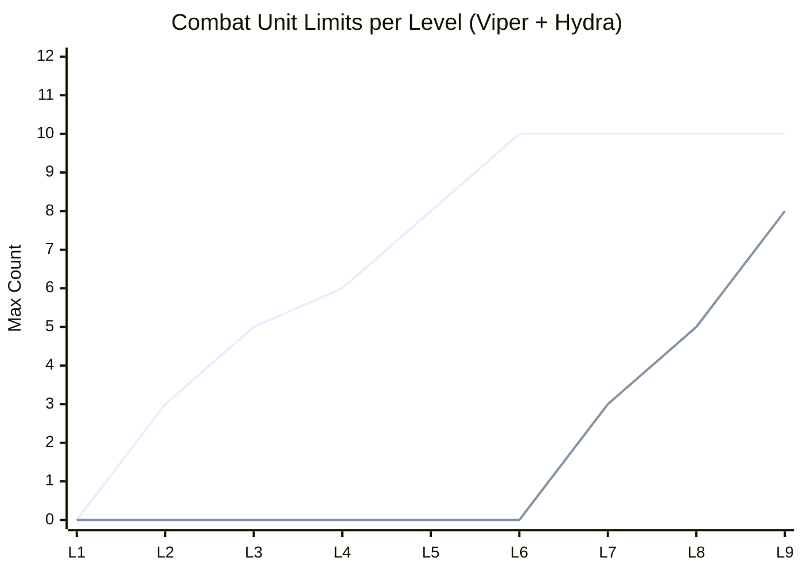
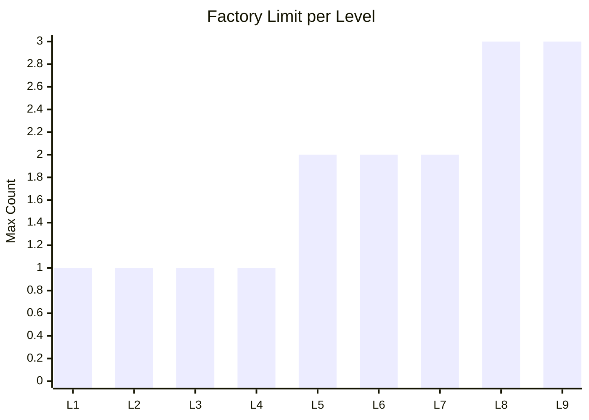
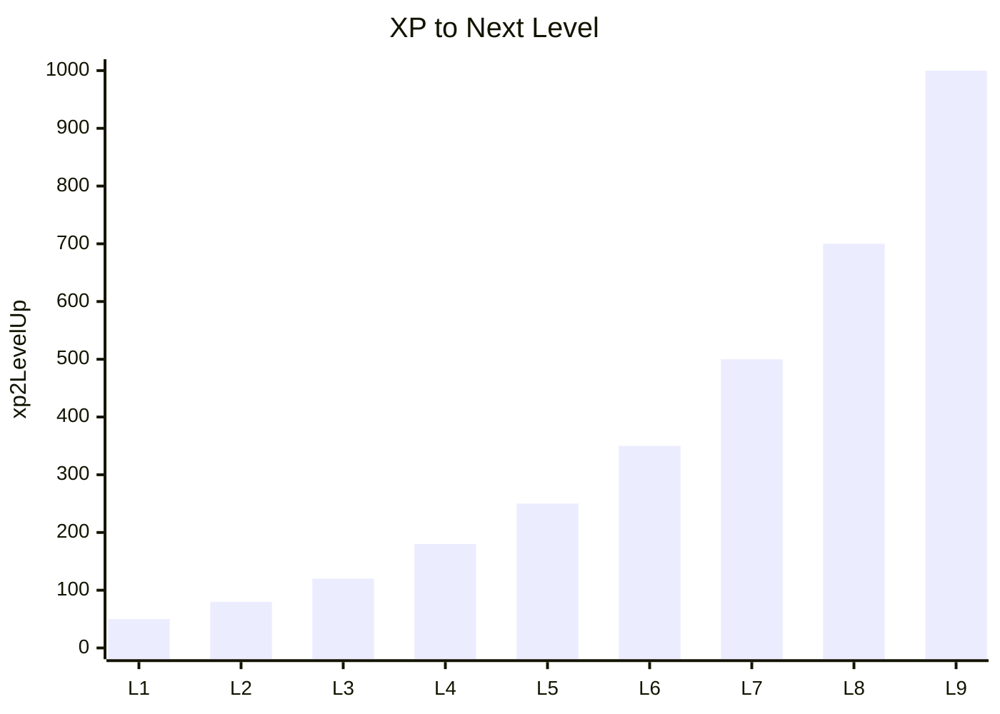
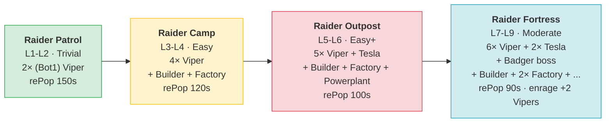
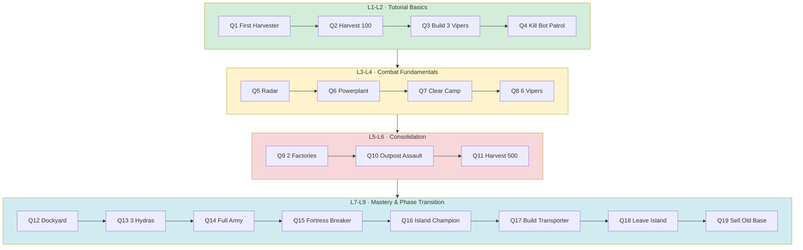
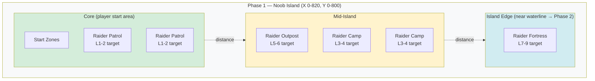

# Phase 1 Plan: Noob Island

> **Status:** Planning document. Source of truth for Phase 1 levels, units, bots, and quests.
> Live migration (razarion.com) happens iteratively, level by level.
>
> **Related documents:** [`progression.md`](progression.md) — strategic multi-phase overview · [`phase-2-plan.md`](phase-2-plan.md) — the next phase (Crystals, boxes, House/Tower/heavy unit).
>
> **Production audit:** §7 reflects a full read of live production (planet 117, server-game-engine 3) on **2026-05-31**. Headline: the player combat/economy units and the bot Tesla/Refinery anchors are **already rebalanced** to the Phase-1 targets; what still differs from the plan is the level-limit/XP curve, the bot encounter set, the quest arc, and the Hydra/Transporter/bot-Viper fine values.
>
> **Bot naming convention:** this doc uses **`(Bot1) X`** for the Phase-1 bot units (vs. **`(Bot2) X`** = the new drop-enabled Phase-2 variants, see [`phase-2-plan.md`](phase-2-plan.md) §4.1). Production internalNames are still **`(Bot) X`** today — rename `(Bot) X` → `(Bot1) X` is a pending cosmetic step (IDs unchanged; bot configs reference by ID, not name).

---

## 1. Concept & Pacing

**Phase 1 region:** Noob Island, bottom-left of Planet 1
- Coordinates: X 0-820, Y 0-800 (~0.66 km²)
- Bounded by lake/water; Phase 2 lies across the water

**Gameplay identity:** Safe tutorial area. Bots do not attack on their own — they only fight back when attacked. Resources are abundant.

**Duration:** 9 levels. An engaged player reaches Level 9 in 30-60 minutes of play.

**Emotional arc per level block:**

| Block | Player feeling |
|---|---|
| L1-L2 | "I'm learning how the game works" |
| L3-L4 | "I can fight and defend myself" |
| L5-L6 | "I have a real army" |
| L7-L9 | "I've mastered the island and I'm ready for Phase 2" |

**Phase 1 → Phase 2 transition:**
At Level 9 the player unlocks the **Transporter** — a water-borne unit that ferries a Builder across the lake into the Phase 2 region. A follow-up quest then asks the player to sell the old base (gives Razarion as starting capital for Phase 2 + frees the island slot for new players).

---

## 2. Available Units & Buildings

All units available in Phase 1 (Live IDs from `base_item_type`).

**Glossary:**
- **DPS** = `weapon.damage / weapon.reloadTime` (sustained damage per second).
- **Buildup** = total work needed to construct this item (`baseItemType.buildup`).
- **Progress** = work produced per second by a Builder or Factory (`builderType.progress` / `factoryType.progress`).
- **Build time** = `target.buildup / producer.progress` seconds. With every producer at progress=1 today, build time in seconds equals the buildup value.

**HP / damage / cost values are the Phase 1 *target* (post-rebalance). See §2.1 (combat / HP) and §2.2 (cost) for derivation. Live values much higher — see §7.1 for the gap.** Buildup, speed, range, and progress are unchanged from Live for now (later balancing steps).

| ID | Name | Role | Cost | HP | Speed | DPS | Range | Buildup | Progress | Unlock |
|---|---|---|---|---|---|---|---|---|---|---|
| 1 | Builder | Construction | 50 | 20 | 12 | – | – | 40 | 1 (builds buildings) | L1 (start) |
| 2 | Harvester | Razarion collection | 25 | 12 | 14 | – | – | 7 | 1 (harvest/sec)* | L1 |
| 4 | Factory | Builds Builder/Harvester/Viper | 35 | 40 | – | – | – | 8 | 1 (builds units) | L1 |
| 3 | Viper | Standard combat unit | 10 | 10 | 17 | 5 | 10 | 5 | – | L2 |
| 6 | Radar | Enables minimap | 35 | 30 | – | – | – | 15 | – | L3 |
| 7 | Powerplant | Power supply (for Radar) | 35 | 30 | – | – | – | 15 | – | L3 |
| 11 | Dockyard | Builds Hydra/Transporter (water) | 35 | 40 | – | – | – | 13 | 1 (builds water units) | L7 |
| 12 | Hydra | Water combat unit | 15 | 12 | 10 | ~6 | 15 | 6 | – | L7 |
| 18 | Transporter | Carries Builder across water | 15 | 8 | 7 | – | – | 10 | – | L9 |

Player starts with 1 Builder and **100 Razarion** (down from Live's 1200 — see §2.2).

**Notes:**
- No static defense and no House in Phase 1 — player relies entirely on the mobile Viper/Hydra army.
- Hydra/Dockyard are water units — give Phase 1 a second front (lake control) in late levels.
- Transporter exists as the Phase 1 → 2 transition mechanic.
- Player house space is fixed at planet-base value (16) for all of Phase 1 — see §3 for army-size implications.
- Hydra in production already carries concrete combat stats: **damage 7, reload 1.2 → DPS 5.83** (HP 13, cost 13 — slightly off the 12 / 15 target). The bot-aggressor balancing step still owns the final number; see §7.1.
- **\*Harvester `progress` is 1 in production, not the 2 this plan assumes.** That halves harvest income and roughly doubles every "time to X Razarion" figure below (§2.2 pacing, Q2/Q11 harvest quests). Either raise production `Harvester.progress` to 2 to match the plan, or re-derive the pacing for progress 1.

### 2.1 HP & Damage Anchor

The Phase 1 numbers are derived from two combat anchors that lock everything else:

**Anchor 1 — Viper kills (Bot1) Refinery in 3 shots:**
- Viper damage = 5, Refinery HP = 15 → 5 + 5 + 5 = 15 ✓

**Anchor 2 — 2 Vipers needed to kill 1 (Bot1) Tesla:**
- Constraint: `Viper.HP × Viper.DPS  <  Tesla.HP × Tesla.DPS  <  3 × Viper.HP × Viper.DPS`
- Locked: Viper 10 HP / 5 DPS · Tesla 30 HP / 3 DPS (damage 6, reload 2)
- 1v1: Viper dies in 3.33s, Tesla in 6s → Tesla wins decisively
- 2v1: Tesla dies in 3s; first Viper takes 9 damage and survives at 1/10 HP — both Vipers alive

**Principle — building HP > vehicle HP:** Every building has more HP than every vehicle. Smallest building (House 25) > biggest vehicle (Builder 20).

**HP layer (Step 1, locked):**

| Type | Vehicle | HP | | Building | HP |
|---|---|---|---|---|---|
| | Transporter | 8 | | House | 25 |
| | Viper *(anchor)* | 10 | | Powerplant | 30 |
| | Harvester | 12 | | Radar | 30 |
| | Hydra | 12 | | Tower | 35 |
| | Builder | 20 | | Factory | 40 |
| | | | | Dockyard | 40 |

Bot reference (locked): (Bot1) Refinery 15, (Bot1) Refinery 2 15, (Bot1) Tesla 30. Other bot units rescaled in the bot-aggressor step.

**Damage layer (Step 1, partially locked):**
- Viper: damage 5, reload 1.0, DPS 5 ✓
- (Bot1) Tesla: damage 6, reload 2.0, DPS 3 ✓ (LIGHTNING, range 15)
- Hydra: damage 7, reload 1.2, DPS 5.83 (production value; final number pending)
- (Bot1) Hydra: damage 7, reload **1.0**, DPS 7 — note bot Hydra out-DPSes the player Hydra (shorter reload)
- (Bot1) Viper, (Bot1) Badger: TBD (still at live values — (Bot1) Viper dmg 10/DPS 10, (Bot1) Badger dmg 20)

**Demolition times (Viper alone vs static target, no return fire):**

| Target | HP | Time @ DPS 5 |
|---|---|---|
| Refinery / Refinery 2 | 15 | 3.0 s |
| House | 25 | 5.0 s |
| Powerplant / Radar / (Bot1) Tesla | 30 | 6.0 s |
| Tower | 35 | 7.0 s |
| Factory / Dockyard | 40 | 8.0 s |

A Viper trio razes a full bot outpost (3× Refinery + 1× Tesla ≈ 75 HP) in ~5 seconds of focused fire — appropriate tutorial pacing.

### 2.2 Cost Anchor

Anchor: **Viper = 10 Razarion**. All costs scale relative to Viper, with the building / vehicle hierarchy preserved from Live.

**Cost layer (Step 1, locked):**

| Item | Live | Target | × Viper | Live factor |
|---|---|---|---|---|
| Viper *(anchor)* | 60 | **10** | 1.0 | ÷6 |
| Hydra | 70 | **15** | 1.5 | ÷4.7 |
| Transporter | 100 | **15** | 1.5 | ÷6.7 |
| Harvester | 150 | **25** | 2.5 | ÷6 |
| Factory | 200 | **35** | 3.5 | ÷5.7 |
| Radar | 200 | **35** | 3.5 | ÷5.7 |
| Powerplant | 200 | **35** | 3.5 | ÷5.7 |
| Dockyard | 200 | **35** | 3.5 | ÷5.7 |
| Tower | 250 | **40** | 4.0 | ÷6.25 |
| Builder | 300 | **50** | 5.0 | ÷6 |
| House | 300 | **50** | 5.0 | ÷6 |
| `startRazarion` | 1200 | **100** | — | ÷12 |

**Notes:**
- Hydra rises slightly relative to Viper (1.5× instead of Live's 1.17×) — clearer "premium water unit" pricing.
- `startRazarion` cut harder than unit costs (÷12 vs ÷6) so the player can't skip the first harvest cycle.

**L1 pacing check** (player starts with 1 Builder + 100 Razarion, no pre-placed Harvester):

| t | Action | Razarion |
|---|---|---|
| 0 s | Start | 100 |
| 8 s | Builder finishes Factory (cost 35) | 65 |
| 15 s | Factory finishes Harvester (cost 25); harvest income begins | 40 + income |
| 20-35 s | Factory builds 5 Vipers (10 each); Harvester adds ~30 | ~30 |

→ Complete starter base (Builder + Factory + Harvester + 5 Vipers) ready in ~35 seconds. Q1-Q3 (Harvester + 3 Vipers) clearable in under 30 seconds.

**Combat-cost efficiency comparison:**
- Live: Viper EHP×DPS / cost = 1500 / 60 = **25** per Razarion
- Target: 50 / 10 = **5** per Razarion (5× less efficient)

A small army feels expensive to lose — losing 4 Vipers costs 40 Razarion = 20 s of harvest = a tangible setback. If this is too punishing in playtest, raise `Harvester.progress` from 2 to 3 (50 % faster economy).

---

## 3. Level Progression

**XP curve:** logarithmic, ~2230 XP total from L1 to L9.

**Item limits per level** (`itemTypeLimitation`):

| Level | xp2Next | Builder (1) | Harvester (2) | Viper (3) | Factory (4) | Radar (6) | Powerplant (7) | Dockyard (11) | Hydra (12) | Transp. (18) |
|---|---|---|---|---|---|---|---|---|---|---|
| **L1** | 50 | 1 | 1 | – | 1 | – | – | – | – | – |
| **L2** | 80 | 1 | 1 | 3 | 1 | – | – | – | – | – |
| **L3** | 120 | 1 | 2 | 5 | 1 | 1 | 1 | – | – | – |
| **L4** | 180 | 2 | 2 | 6 | 1 | 1 | 1 | – | – | – |
| **L5** | 250 | 2 | 2 | 8 | 2 | 1 | 1 | – | – | – |
| **L6** | 350 | 2 | 3 | 10 | 2 | 1 | 1 | – | – | – |
| **L7** | 500 | 2 | 3 | 10 | 2 | 1 | 1 | 1 | 3 | – |
| **L8** | 700 | 2 | 3 | 10 | 3 | 1 | 1 | 1 | 5 | – |
| **L9** | 1000 | 2 | 3 | 10 | 3 | 1 | 1 | 1 | 8 | 2 |

**Planet caps (`Planet.itemTypeLimitation`) must accommodate Level 9:**
- Current: Builder 2, Harvester 3, Viper 20, Factory 4, Radar 1, Powerplant 1, Dockyard 1, Hydra 10, Transporter 2, House 7
- No adjustments needed — current caps cover the plan.

**House space cap = 16 (planet base, no House building):**
- Total mobile units (Builder + Harvester + Viper + Hydra + Transporter) cannot exceed 16.
- L9 max plausible composition: 2 Builder + 3 Harvester + 9 Viper + 2 Hydra = 16 (cap reached).
- L9 limits above (Viper 10, Hydra 8) are **headroom only** — player must choose which slots to fill.
- **Open question (§8):** is 16 too tight for an L9 army? Options: raise planet `houseSpace` to 25-30, or keep tight as a strategic constraint forcing army composition choices.

### 3.1 Combat Capacity Curve

Top line: Viper. Bottom line: Hydra (water, unlocked at L7). Note: Viper limit plateaus at L6 because house space (16) becomes the binding constraint — L7+ growth shifts to water units (Hydra).

### 3.2 Factory Capacity

### 3.3 XP Curve

Logarithmic-ish progression: each level takes ~40-50% longer than the previous.

---

## 4. Bots in Phase 1

Four escalating bot outposts. All **passive** (only fight back when attacked). Uses existing Live units — no new models needed.

### 4.0 Bot Escalation Overview

### 4.1 Raider Patrol (Trivial) — Target L1-L2
- **Composition:** 2× (Bot1) Viper (id 16)
- **Behavior:** Passive, no pursuit
- **rePopTime:** 150 s
- **Enragement:** None
- **Position:** Near player start zones, 3-4 instances

### 4.2 Raider Camp (Easy) — Target L3-L4
- **Composition:** 4× (Bot1) Viper, 1× (Bot1) Builder, 1× (Bot1) Factory
- **Behavior:** Passive, no pursuit, Builder rebuilds losses
- **rePopTime:** 120 s
- **Enragement:** None
- **Position:** Mid-island, 2-3 instances

### 4.3 Raider Outpost (Easy+) — Target L5-L6
- **Composition:** 5× (Bot1) Viper, 1× (Bot1) Tesla, 1× (Bot1) Builder, 1× (Bot1) Factory, 1× (Bot1) Powerplant
- **Behavior:** Passive, static defense anchored on Tesla
- **rePopTime:** 100 s
- **Enragement:** None
- **Position:** Outer island, 2 instances

### 4.4 Raider Fortress (Moderate) — Target L7-L9
- **Composition:** 6× (Bot1) Viper, 2× (Bot1) Tesla, 1× (Bot1) Badger (boss), 1× (Bot1) Builder, 2× (Bot1) Factory, 1× (Bot1) Powerplant, 1× (Bot1) Refinery
- **Behavior:** Passive, strong static defense
- **rePopTime:** 90 s
- **Enragement:** After 5 kills → +2 (Bot1) Viper
- **Position:** Island edge near the waterline, 1-2 instances
- **Note:** (Bot1) Badger acts as the boss (HP 250, dmg 20, range 20, speed 20) — final Phase 1 challenge

---

## 5. Quests

21 quests, grouped by level block. Each block unlocks once `minimalLevelId` is reached.

### 5.0 Quest & Level Flow

### 5.1 Level 1-2: Tutorial Basics

| # | Quest | Trigger | Comparison | Reward |
|---|---|---|---|---|
| Q1 | First Harvester | SYNC_ITEM_CREATED | Harvester ×1 | 20 XP |
| Q2 | First Razarion | HARVEST | 100 Razarion | 30 XP |
| Q3 | First Vipers | SYNC_ITEM_CREATED | Viper ×3 | 40 XP, 50 Razarion |
| Q4 | First Battle | SYNC_ITEM_KILLED | (Bot1) Viper ×2 (botId: Raider Patrol) | 50 XP |

### 5.2 Level 3-4: Combat Fundamentals

| # | Quest | Trigger | Comparison | Reward |
|---|---|---|---|---|
| Q5 | Reconnaissance | SYNC_ITEM_CREATED | Radar ×1 | 60 XP |
| Q6 | Power Up | SYNC_ITEM_CREATED | Powerplant ×1 | 60 XP |
| Q7 | Clear the Camp | BASE_KILLED | Raider Camp ×1 | 120 XP, 100 Razarion |
| Q8 | Growing Force | SYNC_ITEM_CREATED | Viper ×6 (includeExisting) | 100 XP |

### 5.3 Level 5-6: Consolidation

| # | Quest | Trigger | Comparison | Reward |
|---|---|---|---|---|
| Q9 | Second Factory | SYNC_ITEM_CREATED | Factory ×2 (includeExisting) | 120 XP, 100 Razarion |
| Q10 | Outpost Assault | BASE_KILLED | Raider Outpost ×1 | 200 XP, 150 Razarion |
| Q11 | Harvest Master | HARVEST | 500 Razarion total | 180 XP |

### 5.4 Level 7-9: Mastery & Preparation

| # | Quest | Trigger | Comparison | Reward |
|---|---|---|---|---|
| Q12 | Shipyard | SYNC_ITEM_CREATED | Dockyard ×1 | 200 XP, 150 Razarion |
| Q13 | Naval Force | SYNC_ITEM_CREATED | Hydra ×3 | 200 XP |
| Q14 | Full Army | SYNC_ITEM_CREATED | Viper ×9 + Hydra ×3 (includeExisting) | 250 XP |
| Q15 | Fortress Breaker | BASE_KILLED | Raider Fortress ×1 | 400 XP, 300 Razarion |
| Q16 | Island Champion | BASE_KILLED | ×3 (any bot base) | 500 XP, 300 Razarion |
| Q17 | Build the Transporter | SYNC_ITEM_CREATED | Transporter ×1 | 500 XP |
| Q18 | Leave the Island | SYNC_ITEM_POSITION | Builder in Phase 2 region | 600 XP |
| Q19 | Sell the Old Base | SELL | all buildings in Phase 1 region | 500 Razarion |

**Note:** Q18+Q19 mark the phase transition. Q19 rewards the player for freeing their slot for new players.

---

## 6. Map Layout (Phase 1)

**Region:** X 0-820, Y 0-800 (`PlaceConfig` for quest conditions and bot spawn bounds).

Difficulty increases with distance from start zones — the player walks outward as they level up. The Raider Fortress sits at the waterline; defeating it leads naturally into building the Transporter (Q17) and the phase transition (Q18-Q19).

**Start zones:** Several small spawn areas so new players don't overlap. Current Live position is kept (see `update_start_regions`).

**Resource nodes:** Razarion fields within walking range of every start zone. Plentiful supply.

**Waterline:** Forms the Phase 1/2 boundary. Transporter crosses it.

---

## 7. Production Audit (2026-05-31)

Full read of live production: **planet 117**, **server-game-engine 3**. This section replaces the earlier
"Plan vs. Live" guesswork — every value below is what production actually serves today.

Status legend: ✅ matches plan target · ⚠️ value applied but diverges from the plan · 🔧 still at old/live
value, plan change not applied · ❌ missing.

**Summary of where production stands:**
- **Player combat/economy units: done.** Builder, Harvester, Viper, Factory, Radar, Powerplant, Dockyard
  all sit at the Phase-1 targets. `startRazarion`=100, `houseSpace`=16, and the planet caps already cover L9.
- **Bot anchors: done.** (Bot1) Tesla (HP 30 / dmg 6 / DPS 3, LIGHTNING) and both (Bot1) Refineries (HP 15)
  match the §2.1 anchors. (Bot1) Builder/Factory/Dockyard are also already on the low tier.
- **Still open:** Hydra/Transporter fine values, Harvester `progress`, the level-limit + XP curve, the bot
  encounter composition, and the quest arc. Tower & House are untouched (no Phase-1 unlock).

### 7.1 Units — production values

**Player units** (production vs. plan target; speed / buildup / range are production):

| Item | Prod HP | Target HP | Prod cost | Target cost | Combat / other (production) | Status |
|---|---|---|---|---|---|---|
| Builder (1) | 20 | 20 | 50 | 50 | speed 12, buildup 40, progress 1, builds 4/6/7/11/21/23 | ✅ |
| Harvester (2) | 12 | 12 | 25 | 25 | speed 14, buildup 7, **harvest progress 1** | ✅ HP/cost · ⚠️ progress 1 (plan assumes 2) |
| Viper (3) | 10 | 10 | 10 | 10 | dmg 5, range 10, reload 1 (DPS 5), speed 17 | ✅ |
| Factory (4) | 40 | 40 | 35 | 35 | builds 1/2/3 | ✅ |
| Radar (6) | 30 | 30 | 35 | 35 | consumer 100 W | ✅ |
| Powerplant (7) | 30 | 30 | 35 | 35 | generator 200 W | ✅ |
| Dockyard (11) | 40 | 40 | 35 | 35 | builds 12/18, WATER | ✅ |
| Hydra (12) | 13 | 12 | 13 | 15 | dmg 7, range 15, reload 1.2 (DPS 5.83), speed 10 | ⚠️ HP 13≠12, cost 13≠15; dmg now concrete |
| Transporter (18) | 10 | 8 | 15 | 15 | speed 8.33, carries 1× Builder | ⚠️ HP 10≠8; cost ✅ |
| Tower (21) | 259 | 35 | 250 | 40 | dmg 30, range 20, reload 2 | 🔧 not migrated (no Phase-1 unlock) |
| House (23) | 300 | 25 | 300 | 50 | houseType space +5 | 🔧 not migrated (no Phase-1 unlock) |

**Planet-level economy (planet 117):** `startRazarion` = **100** ✅ · `houseSpace` = **16** ✅ ·
`itemTypeLimitation` = {Builder 2, Harvester 3, Viper 20, Factory 4, Radar 1, Powerplant 1, Dockyard 1,
Hydra 10, Transporter 2, House 7} ✅ (covers the L9 plan, no change needed).

**Bot units** — encounter set actually used by the Phase-1 bots:

| Item | Production | Status vs. plan |
|---|---|---|
| (Bot1) Tesla (5) | HP 30, dmg 6, reload 2 (DPS 3), range 15, LIGHTNING, price 0 | ✅ matches anchor |
| (Bot1) Refinery (22) | HP 15, price 0 | ✅ |
| (Bot1) Refinery 2 (24) | HP 15, price 0 | ✅ |
| (Bot1) Builder (13) | HP 20, price 50, builds 5/9/14/15/17/22/24 | ✅ low tier |
| (Bot1) Dockyard (9) | HP 40, price 35, builds 10 | ✅ low tier |
| (Bot1) Factory (15) | HP 40, price 35, builds 8/13/16/20 | ✅ low tier |
| (Bot1) Hydra (10) | HP 13, dmg 7, range 15, reload **1.0** (DPS 7), speed 10, price 13 | ⚠️ out-DPSes player Hydra (shorter reload) |
| (Bot1) Viper (16) | HP 80, dmg 10, range 10, reload 1 (DPS 10), speed 17, price 100 | 🔧 still live values |
| (Bot1) Harvester (8) | HP 200, speed 15, harvest progress 2, price 200 | 🔧 still live |
| (Bot1) Powerplant (14) | HP 400, price 200 | 🔧 still live |
| (Bot1) Radar (17) | HP 400, price 300 | 🔧 still live |
| (Bot1) Badger (20) | HP 250, dmg 20, range 20, speed 20, price 150 | 🔧 still live · not deployed by any bot |

→ The bot economy is half-migrated: builder/factory/dockyard/Tesla/refineries are on the low tier, but the
combat/utility units that haven't been touched (Viper, Harvester, Powerplant, Radar, Badger) still carry the
old high HP. Pick these up in the bot-aggressor step.

### 7.2 Level Limits — production (level IDs 272/265/270/271/273/274/275/276/277, plus 279 = L10 cap)

| Level | Production `itemTypeLimitation` | Plan target | Status |
|---|---|---|---|
| L1 | Builder 1, Harvester 1, Factory 1 | identical | ✅ |
| L2 | + Viper 3 | identical | ✅ |
| L3 | + Radar 1, Powerplant 1 (Viper 3) | Viper 5 | 🔧 raise Viper to 5 |
| L4 | Viper 6 | Viper 6, Builder 2 | 🔧 raise Builder to 2 |
| L5 | identical to L4 (Viper 6) | Viper 8, Factory 2 | 🔧 raise Viper, Factory |
| L6 | + Dockyard 1 (Viper 6) | Viper 10, Harvester 3, no Dockyard yet | 🔧 raise limits; Dockyard L6 → L7 |
| L7 | + Hydra 3 | + Dockyard + Hydra 3 | 🔧 Dockyard sits at L6 in prod; Hydra cap matches |
| L8 | + Transporter 1 (Hydra 3) | Hydra 5, Factory 3, no Transporter yet | 🔧 Transporter L8 → L9; grow Hydra/Factory |
| L9 | identical to L8 (Transporter 1, Hydra 3) | Hydra 8, Transporter 2 | 🔧 raise Hydra; Transporter cap 1 → 2 |

**None of the plan's level changes are applied yet.** Concretely, production still has:
- Viper cap plateauing at 6 from L4 onward (plan grows it to 10).
- Hydra cap fixed at 3 from L7 onward (plan grows it to 8).
- Dockyard unlocking at L6 (plan: L7) and Transporter at L8 (plan: L9).
- No Builder→2 / Harvester→3 growth and no Factory→2/3 growth.

### 7.3 XP Curve — production `xp2LevelUp`

| Level | L1 | L2 | L3 | L4 | L5 | L6 | L7 | L8 | L9 |
|---|---|---|---|---|---|---|---|---|---|
| Production | 10 | 30 | 40 | 40 | 40 | 40 | 40 | 60 | 80 |
| Plan target | 50 | 80 | 120 | 180 | 250 | 350 | 500 | 700 | 1000 |

Status: 🔧 across the board. Production is essentially flat (40 from L3–L7); the plan wants a steeper curve to
lengthen late Phase 1. (L10 / id 279 is a terminal cap with `xp2LevelUp` = 999999999.)

### 7.4 Bots — production reality (7 bot configs on SGE 3)

Production does **not** implement the four-tier Raider Patrol → Camp → Outpost → Fortress escalation. What is
actually deployed:

| Bot id | internalName | autoAttack | Composition (baseItemTypeId) | Place / role |
|---|---|---|---|---|
| 780 | Noob start #1 | no (passive) | 1× (Bot1) Refinery (22), rePop 20000 s | ~(91, 58) — single harvest/intro target |
| 781 | Noob start #2 | no | 1× (Bot1) Refinery (22) | ~(133, 53) |
| 777 | Noob start #3 | no | 1× (Bot1) Refinery (22) | ~(183, 58) |
| 778 | Noob stage 2 | **yes** | 1× Builder (13) + 3× Refinery 2 (24) + 4× Tesla (5), rePop 30–60 s | ~(160, 126) — defended Tesla camp |
| 779 | Noob water | **yes** | 1× Builder (13) + 1× Dockyard (9) + 5× Hydra (10) + 1× Factory (15) + 5× (Bot1) Viper (16), spread-placed | ~(382, 298) — naval bot |
| 782 | Beginner | **yes** | 1× Builder (13) | Beginner start region (Phase-2 seed) |
| 783 | Mountain | no | (empty) | placeholder realm |

**Gap to plan:**
- No escalating Patrol/Camp/Outpost/Fortress tiers and **no Badger boss deployed** anywhere (the unit exists
  but no bot spawns it).
- The "Noob start #1–3" bots are single Refineries (harvest/intro targets), not the planned 2× Viper patrols.
- Bots 778/779/782 run `autoAttack=true`, which contradicts the plan's "all Phase-1 bots passive" identity —
  decide whether to flip these to passive or revise the plan.

### 7.5 Quests — production reality (9 groups on SGE 3)

All rewards are **XP only** (`razarion`=0, `crystal`=0) and quests have no `internalName`. Grouped by
`minimalLevelId` (= level id):

| Group (min level) | Quests (trigger → target) |
|---|---|
| 6 (L1 / 272) | create Factory (4) ×1 · create Harvester (2) ×1 — xp 5 each |
| 9 (L2 / 265) | HARVEST 5 · create Viper (3) ×1 · SYNC_ITEM_KILLED ×1 |
| 8 (L3 / 270) | create Radar (6) ×1 · create Powerplant (7) ×1 — xp 20 each |
| 13 (L3 / 270) | HARVEST 10 · create Viper (3) ×3 |
| 17 (L5 / 273) | kill (Bot1) Refinery 2 (24) ×1 — xp 40 |
| 20 (L6 / 274) | place Dockyard (11) ×1 inside a water polygon (SYNC_ITEM_POSITION) |
| 21 (L7 / 275) | create Hydra (12) ×1 · kill (Bot1) Hydra (10) ×1 |
| 24 (L8 / 276) | create Transporter (18) ×1 · move Builder (1) ×1 across the water (SYNC_ITEM_POSITION, large polygon) |
| 25 (L9 / 277) | SELL Factory (4) ×1 · reposition Factory, then Radar+Powerplant, then 2× Harvester + 6× Viper into Beginner start region 122 · SELL Dockyard (11) ×1 |

**Key points:**
- The **phase-1 → phase-2 transition is already implemented**: group 24 ferries a Builder across the water and
  group 25 rebuilds the economy inside Beginner start region 122 and sells the old base — matching the plan's
  Q17–Q19 intent, mechanically.
- But the arc differs from the plan's named 19-quest design: ~17 quests, **no Razarion rewards**, no
  `BASE_KILLED` bot-base quests (production kills individual bot buildings via `SYNC_ITEM_KILLED` instead), and
  no "Fortress Breaker / Island Champion" quests because no fortress/boss bots exist.
- Start regions: **121 "Noob"** (Phase-1 start) and **122 "Beginner"** (Phase-2 seed). Resource regions: 156
  "Noob" (10× Harvester-resource), 157 "Noob2" (15×), 158 "Beginner" (100×). No box regions.

---

## 8. Open Questions

1. ~~**Existing Live bots:** How far do current bot configs deviate from the plan?~~ **Read (§7.4).** Far: production has 3 single-Refinery passive markers + 1 Tesla camp + 1 naval bot + 1 Beginner seed + 1 empty Mountain — no Patrol/Camp/Outpost/Fortress tiers and no Badger boss. Decide: build out the 4-tier plan, or formalise the simpler production set as the new plan.
2. ~~**Existing Live quests:** What quest configs exist today?~~ **Read (§7.5).** 9 groups, XP-only rewards, phase-transition already wired (groups 24–25). Decide whether to add Razarion rewards and the missing bot-base quests, or accept the leaner production arc.
3. ~~**Start Razarion:** Plan doc says 200 (for Phase 1), Live is 1200.~~ **Resolved:** `startRazarion` is **100** in production (see §2.2/§7.1). Forces an immediate Factory + Harvester build before any Vipers.
   - **Caveat:** the ~35 s starter-base pacing in §2.2 assumes `Harvester.progress`=2, but production runs progress 1 (§7.1) — income is half as fast. Reconcile before trusting the pacing tables.
4. ~~**(Bot1) Tesla in L5-6 outpost:** With 40 DPS and range 15, Tesla is harsh for L5-6 players.~~ **Resolved:** rebalanced to HP 30, dmg 6, DPS 3 (see §2.1) — 1 Viper loses, 2 Vipers win without forced losses.
5. **(Bot1) Badger in Fortress:** Boss mechanic (special reward? drop?) or just a tough unit?
6. **Phase transition route:** The water path from Phase 1 outer edge to Phase 2 — is that route currently navigable? Check heightmap.
7. **Q19 "Sell old base":** How is `SELL` triggered? Sell system in place?
8. **House space cap (16):** Without the House building, the player's army is hard-capped at 16 mobile units. Options: (a) raise planet `houseSpace` to 25-30, (b) keep tight as a strategic constraint. Affects Q14 "Full Army" target counts.
9. **No static defense:** With Tower removed, the player relies entirely on the mobile Viper/Hydra army for defense. Is this the desired Phase 1 feel, or should bots also lose their Tesla static defense for consistency?

---

## 9. Migration Sequence (Proposal)

1. ~~**Read phase** (read, don't write)~~ **Done 2026-05-31 — see §7.** Player units, planet economy, and the
   bot Tesla/Refinery anchors are already on the Phase-1 targets. What remains to write: level limits, XP
   curve, bot encounter set, quest arc, and the Hydra/Transporter/bot-Viper/Harvester-progress fine values.

2. **L1-L2 layer** (start small)
   - Adjust xp2LevelUp (10→50, 30→80) — levels 272, 265
   - Decide the L1-L2 quest arc: keep production groups 6 + 9 (create Factory/Harvester/Viper, HARVEST,
     kill ×1) or rework toward the named Q1-Q4 (and whether to add Razarion rewards)
   - Decide the Bot Patrol question (§8.1): production "Noob start #1-3" are single passive Refineries, not
     2× Viper patrols
   - Reconcile `Harvester.progress` 1 vs 2 (§7.1) before tuning economy quests
   - Warm-restart, test in browser

3. **L3-L4 layer**
   - Raise Viper limit (3→5 at L3, →6 at L4)
   - Unlock Radar + Powerplant at L3
   - Create Q5-Q8
   - Place Bot Camp

4. **L5-L6 layer**
   - Raise limits, Q9-Q11
   - Bot Outpost (with Tesla)

5. **L7-L9 layer**
   - Unlock Dockyard/Hydra at L7
   - Unlock Transporter at L9
   - Q12-Q19 — including phase transition quests
   - Bot Fortress (with Badger boss)

6. **Balancing pass**
   - Only after migration: tune concrete values (HP, DPS, cost) based on actual play tests

One mini iteration per layer: change → warm-restart → play → tune.
