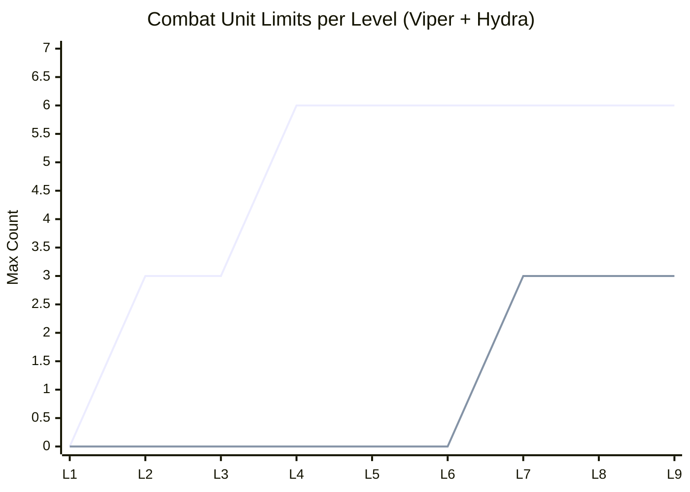
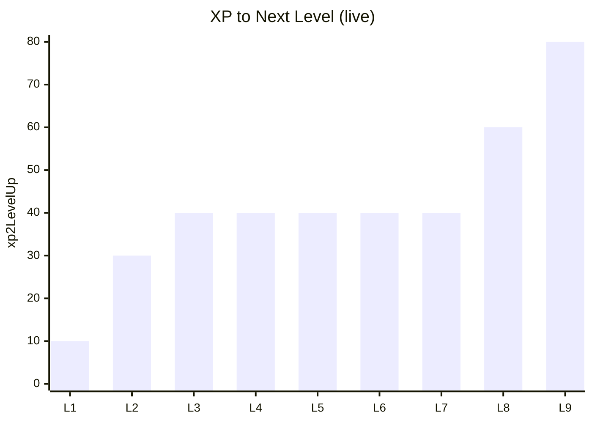
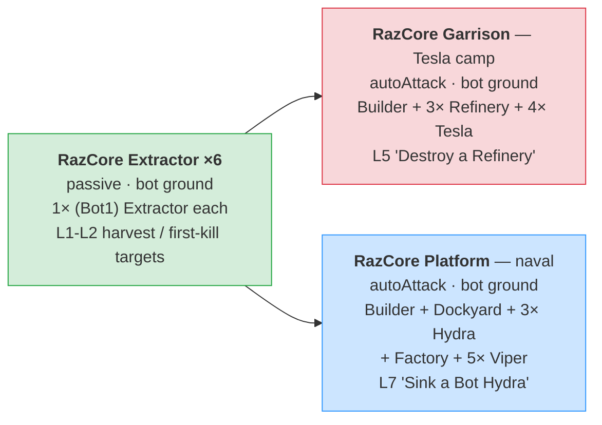
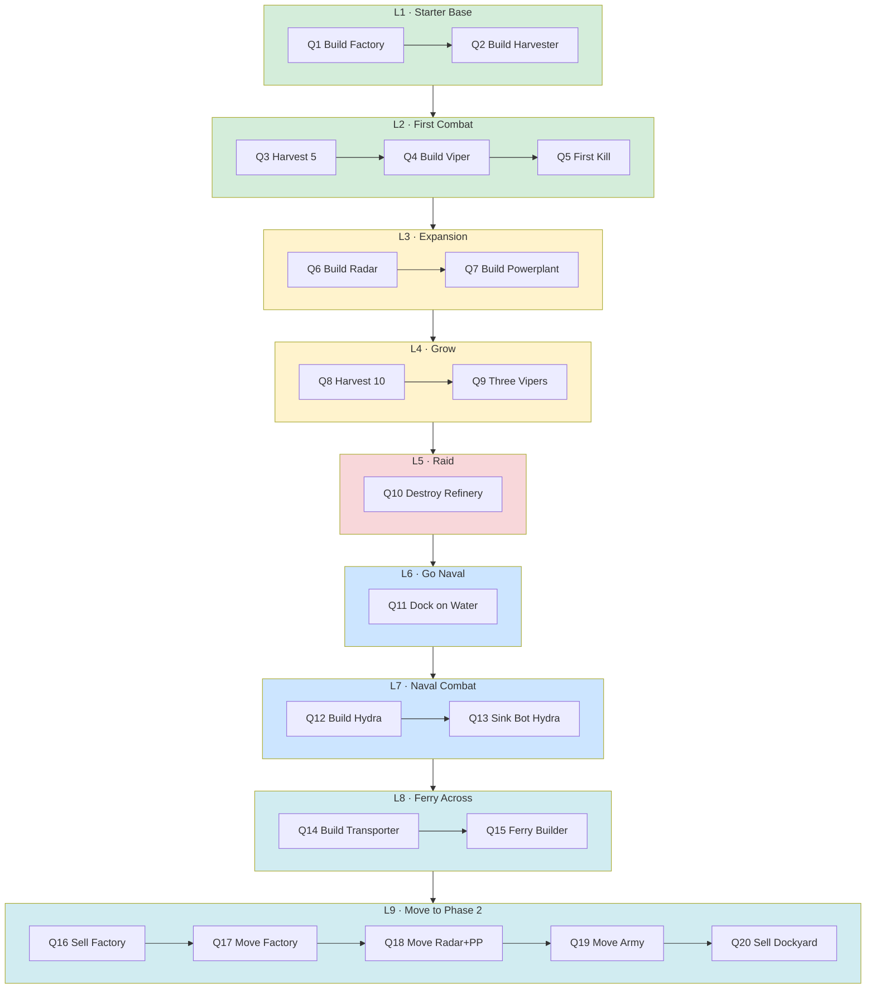
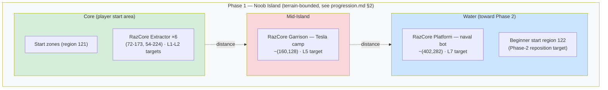

# Phase 1 Plan: Noob Island

> **Status: FINAL — live spec, synced to PROD (razarion.com).** Phase 1 (levels L1–L9) is fully built and playable on **production** (`razarion.com`, planet 117, server-game-engine 3) as of **2026-06-03**. **This document describes the live PROD config as the source of truth**, not aspirational targets: §2 units, §3 levels, §4/§7.4 bots, §5 quests, §6 map all match what the production server serves today (and localhost mirrors it). The original design rationale (combat anchors, cost logic) is kept in §2.1/§2.2 as the *why* behind the live numbers. The earlier bot-HP concern (R1) was fixed — the deployed (Bot1) Viper is now HP 10.
>
> **Antagonist faction — RazCore:** the Phase-1 enemy bots are the **RazCore** mining corporation (an evil resource-extraction AI; the name is Glencore-flavored, deliberately apolitical). Their bot configs carry the player-facing display names **RazCore Extractor**, **RazCore Garrison**, and **RazCore Platform** (shown as the cockpit title). The player fights RazCore to reclaim the island's Razarion.
>
> **Related documents:** [`progression.md`](progression.md) — strategic multi-phase overview · [`phase-2-plan.md`](phase-2-plan.md) — the next phase (Crystals, boxes, House/Tower/heavy unit).
>
> **Bots synced to PROD (2026-06-03):** §4 / §7.4 document the **8 live bot configs** — 6× **RazCore Extractor** (passive single-Extractor outposts), 1× **RazCore Garrison** (Tesla camp), 1× **RazCore Platform** (naval bot), all on bot ground. The old four-tier Patrol/Camp/Outpost/Fortress design was dropped, and the earlier localhost "Beginner seed" + "Mountain placeholder" configs were **removed on PROD** (so R2 is closed). §7's "plan vs production" audit is superseded (see the §7 banner). Bot building names were cleaned up (Extractor / Refinery — no more "Refinery 2") and the deployed bot Viper rescaled to HP 10.
>
> **Bot naming convention:** this doc uses **`(Bot1) X`** for the Phase-1 bot units (vs. **`(Bot2) X`** = the new drop-enabled Phase-2 variants, see [`phase-2-plan.md`](phase-2-plan.md) §4.1). On PROD the deployed bot units have **already been renamed** `(Bot) X` → `(Bot1) X` (ids 5, 9, 10, 13, 15, 16, 22, 24), with "Razarion Industries" replaced by "RazCore" in their descriptions. Only the four **undeployed** units (8 Harvester, 14 Powerplant, 17 Radar, 20 Badger) still carry the old `(Bot) X` prefix (§7.1).

---

## 1. Concept & Pacing

**Phase 1 region:** Noob Island, bottom-left of Planet 1
- Coordinates: terrain-bounded zone in the bottom-left (~0.43 km²); exact 7-corner boundary in [`progression.md`](progression.md) §2
- Bounded by lake/water; Phase 2 lies across the water

**Gameplay identity:** Mostly-safe tutorial area. The six **RazCore Extractor** outposts are **passive** (fight back only when attacked) — the player learns the basics against harmless targets. Two RazCore bots are **aggressive within their realm** (`autoAttack`): the **RazCore Garrison** (Tesla camp, L5) and the **RazCore Platform** (naval, L7), which engage the player on approach and gate the two combat quests. Resources are abundant.

**Duration:** 9 levels. An engaged player reaches Level 9 in 30-60 minutes of play.

**Emotional arc per level block:**

| Block | Player feeling |
|---|---|
| L1-L2 | "I'm learning how the game works" |
| L3-L4 | "I can fight and defend myself" |
| L5-L6 | "I have a real army" |
| L7-L9 | "I've mastered the island and I'm ready for Phase 2" |

**Phase 1 → Phase 2 transition:**
At **Level 8** the player unlocks the **Transporter** — a water-borne unit that ferries a Builder across the lake into the Phase 2 region. At **Level 9** a sequence of quests then sells the old base and repositions the economy into the Phase-2 Beginner region (gives a head start for Phase 2 + frees the island slot for new players). See §5.1 Q14–Q20.

---

## 2. Available Units & Buildings

All units available in Phase 1 (Live IDs from `base_item_type`).

**Glossary:**
- **DPS** = `weapon.damage / weapon.reloadTime` (sustained damage per second).
- **Buildup** = total work needed to construct this item (`baseItemType.buildup`).
- **Progress** = work produced per second by a Builder or Factory (`builderType.progress` / `factoryType.progress`).
- **Build time** = `target.buildup / producer.progress` seconds. With every producer at progress=1 today, build time in seconds equals the buildup value.

**All HP / cost / combat values below are the *live* localhost values** (read from `base_item_type` on 2026-06-02). §2.1 (combat / HP) and §2.2 (cost) explain the design rationale behind them.

| ID | Name | Role | Cost | HP | Speed | DPS | Range | Buildup | Progress | First unlocked |
|---|---|---|---|---|---|---|---|---|---|---|
| 1 | Builder | Construction | 50 | 20 | 12 | – | – | 40 | 1 (builds buildings) | L1 (start) |
| 2 | Harvester | Razarion collection | 25 | 12 | 14 | – | – | 7 | 1 (harvest/sec)* | L1 |
| 4 | Factory | Builds Builder/Harvester/Viper | 35 | 40 | – | – | – | 8 | 1 (builds units) | L1 |
| 3 | Viper | Standard combat unit | 10 | 10 | 17 | 5 | 10 | 5 | – | L2 |
| 6 | Radar | Enables minimap | 35 | 30 | – | – | – | 15 | – | L3 |
| 7 | Powerplant | Power supply (for Radar) | 35 | 30 | – | – | – | 15 | – | L3 |
| 11 | Dockyard | Builds Hydra/Transporter (water) | 35 | 40 | – | – | – | 8 | 1 (builds water units) | L6 |
| 12 | Hydra | Water combat unit | 13 | 13 | 10 | 5.83 | 15 | 6 | – | L7 |
| 18 | Transporter | Carries Builder across water | 15 | 10 | 8.33 | – | – | 7 | – | L8 |

Player starts with 1 Builder and **100 Razarion** (`startBaseItemTypeId` 1, `startRazarion` 100).

**Notes:**
- No static defense and no House in Phase 1 — player relies entirely on the mobile Viper/Hydra army. (Tower 21 and House 23 exist as item types but are not in any L1–L9 `itemTypeLimitation`, so they are not buildable in Phase 1.)
- Hydra/Dockyard are water units — give Phase 1 a second front (lake control) in late levels.
- Transporter exists as the Phase 1 → 2 transition mechanic (`itemContainerType` carries 1× Builder, range 20).
- Player house space is fixed at planet-base value (`houseSpace` 16) for all of Phase 1 — see §3 for army-size implications. Every unit consumes 1 house space.
- **Hydra (live):** damage 7, reload 1.2 → **DPS 5.83**, HP 13, cost 13. Note the **(Bot1) Hydra (10)** out-DPSes it (reload 1.0 → DPS 7); the bot-aggressor pass owns that number (§7.4).
- **\*Harvester `progress` is 1** (live), so harvest income is modest; the "time to X Razarion" pacing in §2.2 was written assuming progress 2 — halve the income / double those times for the live config (the live harvest quests Q3/Q8 ask for only 5 / 10 Razarion, so this barely matters in practice).

### 2.1 HP & Damage Anchor

The Phase 1 numbers are derived from two combat anchors that lock everything else:

**Anchor 1 — Viper kills a bot structure in 3 shots:**
- Viper damage = 5, bot structure HP = 15 (Extractor / Refinery) → 5 + 5 + 5 = 15 ✓

**Anchor 2 — 2 Vipers needed to kill 1 (Bot1) Tesla:**
- Constraint: `Viper.HP × Viper.DPS  <  Tesla.HP × Tesla.DPS  <  3 × Viper.HP × Viper.DPS`
- Locked: Viper 10 HP / 5 DPS · Tesla 30 HP / 3 DPS (damage 6, reload 2)
- 1v1: Viper dies in 3.33s, Tesla in 6s → Tesla wins decisively
- 2v1: Tesla dies in 3s; first Viper takes 9 damage and survives at 1/10 HP — both Vipers alive

**Principle — building HP > vehicle HP:** Every building has more HP than every vehicle. Smallest buildable Phase-1 building (Powerplant/Radar 30) > biggest vehicle (Builder 20).

**HP layer (Step 1, locked):**

| Type | Vehicle | HP | | Building | HP |
|---|---|---|---|---|---|
| | Viper *(anchor)* | 10 | | Powerplant | 30 |
| | Harvester | 12 | | Radar | 30 |
| | Hydra | 13 | | Factory | 40 |
| | Transporter | 10 | | Dockyard | 40 |
| | Builder | 20 | | | |

(Live Phase-1 buildings: Powerplant/Radar 30, Factory/Dockyard 40. Tower 35 / House 25 are not buildable in Phase 1 — see §2 notes.)

Bot reference (live): (Bot1) Extractor 15, (Bot1) Refinery 15, (Bot1) Tesla 30, (Bot1) Viper **10** (rescaled to match the player Viper). Undeployed bot units (Harvester/Powerplant/Radar/Badger) still carry old high HP — see §7.1.

**Damage layer (Step 1, partially locked):**
- Viper: damage 5, reload 1.0, DPS 5 ✓
- (Bot1) Tesla: damage 6, reload 2.0, DPS 3 ✓ (LIGHTNING, range 15)
- Hydra: damage 7, reload 1.2, DPS 5.83 (live value)
- (Bot1) Hydra: damage 7, reload **1.0**, DPS 7 — note bot Hydra out-DPSes the player Hydra (shorter reload)
- (Bot1) Viper: HP **10** (rescaled to the player Viper), dmg 10 / DPS 10 — hits twice as hard as a player Viper but dies just as fast. (Bot1) Badger dmg 20 (undeployed)

**Demolition times (Viper alone vs static target, no return fire):**

| Target | HP | Time @ DPS 5 |
|---|---|---|
| Extractor / Refinery | 15 | 3.0 s |
| House | 25 | 5.0 s |
| Powerplant / Radar / (Bot1) Tesla | 30 | 6.0 s |
| Tower | 35 | 7.0 s |
| Factory / Dockyard | 40 | 8.0 s |

A Viper trio razes a full bot outpost (3× Refinery + 1× Tesla ≈ 75 HP) in ~5 seconds of focused fire — appropriate tutorial pacing.

### 2.2 Cost Anchor

Anchor: **Viper = 10 Razarion**. All costs scale relative to Viper, with the building / vehicle hierarchy preserved from Live.

**Cost layer (live, vs. the old pre-rebalance values):**

| Item | Old | Live | × Viper |
|---|---|---|---|
| Viper *(anchor)* | 60 | **10** | 1.0 |
| Hydra | 70 | **13** | 1.3 |
| Transporter | 100 | **15** | 1.5 |
| Harvester | 150 | **25** | 2.5 |
| Factory | 200 | **35** | 3.5 |
| Radar | 200 | **35** | 3.5 |
| Powerplant | 200 | **35** | 3.5 |
| Dockyard | 200 | **35** | 3.5 |
| Builder | 300 | **50** | 5.0 |
| `startRazarion` | 1200 | **100** | — |

(Tower 40 / House 50 keep their target costs but are not buildable in Phase 1.)

**Notes:**
- Hydra sits at 13 (1.3× Viper) — a slight "premium water unit" premium over the Viper.
- `startRazarion` cut harder than unit costs (÷12 vs ÷6) so the player can't skip the first harvest cycle.

**L1 pacing check** (player starts with 1 Builder + 100 Razarion, no pre-placed Harvester):

| t | Action | Razarion |
|---|---|---|
| 0 s | Start | 100 |
| 8 s | Builder finishes Factory (cost 35) | 65 |
| 15 s | Factory finishes Harvester (cost 25); harvest income begins | 40 + income |
| 20-35 s | Factory builds 5 Vipers (10 each); Harvester adds ~30 | ~30 |

→ Complete starter base (Builder + Factory + Harvester + 5 Vipers) ready in ~35 seconds. The L1–L2 build quests (Q1 Factory, Q2 Harvester, Q4 first Viper) are clearable in under 30 seconds.

**Combat-cost efficiency comparison:**
- Old (pre-rebalance): Viper EHP×DPS / cost = 1500 / 60 = **25** per Razarion
- Live: 50 / 10 = **5** per Razarion (5× less efficient)

A small army feels expensive to lose — losing 4 Vipers costs 40 Razarion = a tangible setback. If the economy feels too slow in playtest, raise the live `Harvester.progress` (currently 1) for a faster economy.

### 2.3 Live in-game descriptions (PROD)

The player-facing `description` strings as served on PROD (read 2026-06-03). These are the short cockpit subtitles; they are deliberately curated for consistency. **Producer buildings follow one scheme: Factory → "Builds land vehicles", Dockyard → "Builds water vehicles"** (player and bot identical), since each Factory builds land vehicles (incl. the non-combat Builder/Harvester) and each Dockyard builds water vehicles (incl. the non-combat Transporter) — so "combat units" / "warships" was dropped.

**Player units & buildings:**

| ID | Name | description |
|---|---|---|
| 1 | Builder | Builds and repairs buildings |
| 2 | Harvester | Mines Razarion |
| 3 | Viper | Fast attack unit |
| 4 | Factory | Builds land vehicles |
| 6 | Radar | Reveals the map |
| 7 | Powerplant | Generates electric power |
| 11 | Dockyard | Builds water vehicles |
| 12 | Hydra | Armed warship |
| 18 | Transporter | Ferries units across water |

**RazCore bot units & buildings (deployed `(Bot1)` set):**

| ID | internalName | description |
|---|---|---|
| 5 | (Bot1) Tesla | Strikes attackers with lightning |
| 9 | (Bot1) Dockyard | Builds water vehicles |
| 10 | (Bot1) Hydra | Armed warship |
| 13 | (Bot1) Builder | Builds and repairs enemy structures |
| 15 | (Bot1) Factory | Builds land vehicles |
| 16 | (Bot1) Viper | Fast attack unit |
| 22 | (Bot1) Extractor | Mines Razarion from the ground |
| 24 | (Bot1) Refinery | Refines mined Razarion |

The four **undeployed** units (8 `(Bot) Harvester`, 14 `(Bot) Powerplant`, 17 `(Bot) Radar`, 20 `(Bot) Badger`) are not surfaced to the player and keep their legacy text.

---

## 3. Level Progression

**XP curve (live):** flat, **380 XP total** from L1 to L9 (10 · 30 · 40·5 · 60 · 80).

**Item limits per level** (live `itemTypeLimitation`, read 2026-06-02). "–" = not yet buildable at that level:

| Level | id | xp2Next | Builder (1) | Harvester (2) | Viper (3) | Factory (4) | Radar (6) | Powerplant (7) | Dockyard (11) | Hydra (12) | Transp. (18) |
|---|---|---|---|---|---|---|---|---|---|---|---|
| **L1** | 272 | 10 | 1 | 1 | – | 1 | – | – | – | – | – |
| **L2** | 265 | 30 | 1 | 1 | 3 | 1 | – | – | – | – | – |
| **L3** | 270 | 40 | 1 | 1 | 3 | 1 | 1 | 1 | – | – | – |
| **L4** | 271 | 40 | 1 | 1 | 6 | 1 | 1 | 1 | – | – | – |
| **L5** | 273 | 40 | 1 | 1 | 6 | 1 | 1 | 1 | – | – | – |
| **L6** | 274 | 40 | 1 | 1 | 6 | 1 | 1 | 1 | 1 | – | – |
| **L7** | 275 | 40 | 1 | 1 | 6 | 1 | 1 | 1 | 1 | 3 | – |
| **L8** | 276 | 60 | 1 | 1 | 6 | 1 | 1 | 1 | 1 | 3 | 1 |
| **L9** | 277 | 80 | 1 | 1 | 6 | 1 | 1 | 1 | 1 | 3 | 1 |

The live curve is **lean and flat**: only the Viper grows (3 → 6 at L4), Hydra appears at L7 (cap 3), Transporter at L8 (cap 1). Builder, Harvester, and Factory stay at **1** the whole phase. Unlock milestones: Viper L2 · Radar+Powerplant L3 · Dockyard L6 · Hydra L7 · Transporter L8.

**Planet caps (`Planet.itemTypeLimitation`, planet 117):** Builder 2, Harvester 3, Viper 20, Factory 4, Radar 1, Powerplant 1, Dockyard 1, Hydra 10, Transporter 2, House 7. These are **far above** what the L1–L9 limits grant (Viper 6, Hydra 3, Factory 1, …), so the **per-level limits are the binding constraint** in Phase 1, not the planet caps.

**House space = 16 (`houseSpace`, no House building):** the largest L9 composition the level limits even allow is Builder 1 + Harvester 1 + Viper 6 + Hydra 3 + Transporter 1 = **12 units** — comfortably under 16. So **house space is not a binding constraint** in the live Phase 1; the level item-limits cap the army first.

### 3.1 Combat Capacity Curve

Top line: Viper (caps at 6 from L4). Bottom line: Hydra (water, cap 3 from L7). A small, tight Phase-1 army by design.

### 3.2 Factory Capacity

**Factory stays at 1** for the entire phase (planet cap is 4, but no level raises the per-level limit above 1) — a single Factory is the player's only land-unit producer in Phase 1.

### 3.3 XP Curve

A short, mostly flat curve: a quick L1→L2 ramp, a flat 40 XP through the mid-game (L3–L7), then a gentle rise at L8–L9. Total 380 XP across the phase.

---

## 4. Bots in Phase 1

**Live PROD bot set — 8 configs on SGE 3** (read 2026-06-03, all of the **RazCore** faction). Every Phase-1 bot sits on a **bot-ground patch** (`groundBoxEnabled`), so its footprint is visible on the terrain. Six are **passive** (fight back only when attacked); two — the Garrison and the Platform — run **`autoAttack`** and anchor the L5 and L7 combat quests. Compositions use the (Bot1) units. (Bot config IDs regenerate on each restart — the **internalName** is the stable anchor; current PROD ids 1065–1072.)

### 4.0 Bot Overview

All 8 configs are combat/economy bots — the old localhost **Beginner seed** and empty **Mountain placeholder** were **removed on PROD** (R2 closed, §8).

### 4.1 RazCore Extractor (×6, passive)
- **Display name:** "RazCore Extractor" · **internalNames:** `(Bot1) Extractor 1`–`6`
- **Composition (each):** 1× (Bot1) Extractor (22), rePop 20000 s
- **Behavior:** passive (`autoAttack=false`), no pursuit
- **Bot ground:** 1 patch each, heights staggered 0.8–2.0 to sit on the terrain
- **Positions** (Extractor 1→6): (80, 224) · (72, 184) · (80, 112) · (89, 58) · (136, 54) · (173, 57)
- **Role:** the L1–L2 intro/harvest targets; the L2 "First Kill" quest (kill ×1) is satisfied by destroying one

### 4.2 RazCore Garrison — Tesla camp (autoAttack)
- **Display name:** "RazCore Garrison" · **internalName:** `(Bot1) Garrison`
- **Composition:** 1× (Bot1) Builder (13) + 3× (Bot1) Refinery (24) + 4× (Bot1) Tesla (5)
- **Behavior:** `autoAttack=true`; static Tesla defense, Builder rebuilds losses
- **Bot ground:** ~25 tiles (height 0.55) · **Position:** ~(160, 128), Teslas at the four corners (144–176, 110–133)
- **Role:** the defended mid encounter; the L5 quest "Destroy a Refinery" targets a Refinery (24) here

### 4.3 RazCore Platform — naval bot (autoAttack)
- **Display name:** "RazCore Platform" · **internalName:** `(Bot1) Water`
- **Composition:** 1× (Bot1) Builder (13) + 1× (Bot1) Dockyard (9) + 3× (Bot1) Hydra (10) + 1× (Bot1) Factory (15) + 5× (Bot1) Viper (16)
- **Behavior:** `autoAttack=true`; spread-placed fleet on the water
- **Bot ground:** ~33 tiles (height 0.4) · **Position:** ~(402, 282)
- **Role:** the naval encounter; the L7 quest "Sink a Bot Hydra" targets a Hydra (10) here

**Note:** the original aspirational four-tier design (Raider Patrol → Camp → Outpost → Fortress with a Badger boss) was **not** built — there is no Badger boss and no escalating Viper tiers. The live RazCore set above is the Phase-1 bot reality. No enragement states are configured.

---

## 5. Quests

**20 live quests** (server-game-engine 3), consolidated into one table (§5.1) ordered by level. This reflects the **actual production/localhost config** read 2026-06-02 — the leaner live arc, XP-only, with no `BASE_KILLED` bot-base quests. Each level's quest XP sums exactly to its `xp2LevelUp` (§5.1). The original aspirational 19-quest design (Razarion rewards, named bot-base objectives) was never built.

### 5.0 Quest & Level Flow

### 5.1 All Quests (live, L1–L9)

The actual production/localhost quest arc (server-game-engine 3, read 2026-06-02), one table ordered by level. All rewards are **XP only** (no Razarion, no Crystals); live quests carry no `internalName`, so the names below are descriptive. Item IDs in parentheses. Level→group map: L1=272/grp6, L2=265/grp9, L3=270/grp8, L4=271/grp13, L5=273/grp17, L6=274/grp20, L7=275/grp21, L8=276/grp24, L9=277/grp25.

| # | Quest | Lvl | Trigger | Target | XP |
|---|---|---|---|---|---|
| Q1 | Build a Factory | L1 | SYNC_ITEM_CREATED | Factory (4) ×1 | 5 |
| Q2 | Build a Harvester | L1 | SYNC_ITEM_CREATED | Harvester (2) ×1 | 5 |
| Q3 | First Harvest | L2 | HARVEST | 5 Razarion | 5 |
| Q4 | Build a Viper | L2 | SYNC_ITEM_CREATED | Viper (3) ×1 | 10 |
| Q5 | First Kill | L2 | SYNC_ITEM_KILLED | ×1 (any) | 15 |
| Q6 | Build a Radar | L3 | SYNC_ITEM_CREATED | Radar (6) ×1 | 20 |
| Q7 | Build a Powerplant | L3 | SYNC_ITEM_CREATED | Powerplant (7) ×1 | 20 |
| Q8 | Harvest 10 | L4 | HARVEST | 10 Razarion | 20 |
| Q9 | Three Vipers | L4 | SYNC_ITEM_CREATED | Viper (3) ×3 | 20 |
| Q10 | Destroy a Refinery | L5 | SYNC_ITEM_KILLED | (Bot1) Refinery (24) ×1 | 40 |
| Q11 | Dock on the Water | L6 | SYNC_ITEM_POSITION | Dockyard (11) ×1 in a water polygon | 40 |
| Q12 | Build a Hydra | L7 | SYNC_ITEM_CREATED | Hydra (12) ×1 | 20 |
| Q13 | Sink a Bot Hydra | L7 | SYNC_ITEM_KILLED | (Bot1) Hydra (10) ×1 | 20 |
| Q14 | Build a Transporter | L8 | SYNC_ITEM_CREATED | Transporter (18) ×1 | 20 |
| Q15 | Ferry the Builder | L8 | SYNC_ITEM_POSITION | Builder (1) ×1 across the water (large polygon) | 40 |
| Q16 | Sell the Factory | L9 | SELL | Factory (4) ×1 | 10 |
| Q17 | Move the Factory | L9 | SYNC_ITEM_POSITION | Factory (4) ×1 → Beginner region (122) | 20 |
| Q18 | Move Radar & Powerplant | L9 | SYNC_ITEM_POSITION | Radar (6) ×1 + Powerplant (7) ×1 → Beginner region (122) | 20 |
| Q19 | Move the Army | L9 | SYNC_ITEM_POSITION | Harvester (2) ×1 + Viper (3) ×6 → Beginner region (122) | 20 |
| Q20 | Sell the Dockyard | L9 | SELL | Dockyard (11) ×1 | 10 |

**XP per level (sum):** L1 10 · L2 30 · L3 40 · L4 40 · L5 40 · L6 40 · L7 40 · L8 60 · L9 80 — **each level's quest XP sums exactly to its `xp2LevelUp`** (§3), so completing a level's quests levels the player up. (This is why the Harvest-10 + 3-Vipers group sits at L4: it splits the old L3 block so L3 and L4 each total 40.)

**Note:** Q16–Q20 (L9) are the **phase transition**: sell the old base, ferry/reposition the economy (Factory, Radar, Powerplant, 1 Harvester + 6 Vipers) into the Phase-2 **Beginner start region 122**, and sell the Dockyard. This is already live (groups 24–25) and matches the intended Phase-1→2 handoff.

---

## 6. Map Layout (Phase 1)

**Region:** the Phase-1 terrain zone in the bottom-left (exact 7-corner boundary in [`progression.md`](progression.md) §2). Quest conditions and bot spawn bounds use their own polygons (§7.5).

Difficulty rises with distance: the six passive RazCore Extractor outposts cluster around the start zones (L1–L2 targets), the autoAttack RazCore Garrison sits mid-island (L5 target), and the RazCore Platform is out on the water (L7 target). Reaching the water and clearing it leads into building the Transporter (Q14) and the phase transition (Q15–Q20). Each bot stands on a visible bot-ground patch.

**Start zones:** Several small spawn areas so new players don't overlap. Current Live position is kept (see `update_start_regions`).

**Resource nodes:** Razarion fields within walking range of every start zone. Plentiful supply.

**Waterline:** Forms the Phase 1/2 boundary. Transporter crosses it.

---

## 7. Production Audit (historical, 2026-05-31)

> **Superseded.** This section captured the gap between the old aspirational plan and live production on 2026-05-31. **For L1–L9 that gap is now closed** — §2 (units), §3 (levels), §5 (quests), and §4/§7.4 (bots) all document the live config directly. The old player-unit / level-limit / XP-curve audit tables were removed (their content is now the live spec in §2/§3). What remains here is **bot unit reference data** for the one open balance item.

### 7.1 Bot unit values (reference for the HP balance pass)

The (Bot1) unit values currently in production. **Every unit a live bot actually deploys is now on the low tier** (incl. the rescaled Viper, HP 10); only undeployed units still carry old high HP:

| Item | Production | Note |
|---|---|---|
| (Bot1) Tesla (5) | HP 30, dmg 6, reload 2 (DPS 3), range 15, LIGHTNING, price 0 | matches the §2.1 anchor |
| (Bot1) Extractor (22) | HP 15, price 0 | low tier |
| (Bot1) Refinery (24) | HP 15, price 0 | low tier |
| (Bot1) Builder (13) | HP 20, price 50, builds 5/9/14/15/17/22/24 | low tier |
| (Bot1) Dockyard (9) | HP 40, price 35, builds 10 | low tier |
| (Bot1) Factory (15) | HP 40, price 35, builds 8/13/16/20 | low tier |
| (Bot1) Hydra (10) | HP 13, dmg 7, range 15, reload **1.0** (DPS 7), speed 10, price 13 | out-DPSes the player Hydra |
| (Bot1) Viper (16) | HP **10**, dmg 10, range 10, reload 1 (DPS 10), speed 17, price 100 | rescaled to player HP; DPS still 10 |
| (Bot1) Harvester (8) | HP 200, speed 15, harvest progress 2, price 200 | still old high HP |
| (Bot1) Powerplant (14) | HP 400, price 200 | still old high HP |
| (Bot1) Radar (17) | HP 400, price 300 | still old high HP |
| (Bot1) Badger (20) | HP 250, dmg 20, range 20, speed 20, price 150 | not deployed by any live bot |

→ Deployed bot units (Tesla, Extractor, Refinery, Builder, Dockyard, Factory, Hydra, Viper) are all on the low tier. The **undeployed** Harvester/Powerplant/Radar/Badger still carry old high HP — harmless until a bot uses them.

### 7.2 Level limits & XP — see §3

The live level `itemTypeLimitation` and `xp2LevelUp` values are the spec and are documented in **§3** (with level IDs). The old "plan target" comparison columns were dropped. (L10 / id 279 remains a terminal cap with `xp2LevelUp` = 999999999.)

### 7.4 Bots — live PROD (2026-06-03)

Live PROD bot set as of **2026-06-03** — 8 configs of the **RazCore** faction, all on bot ground (`groundBoxEnabled`). IDs regenerate on restart; anchor by **internalName**. (Full detail in §4.)

| internalName | display name | autoAttack | bot ground | Composition (baseItemTypeId) | Place / role |
|---|---|---|---|---|---|
| (Bot1) Extractor 1 | RazCore Extractor | no | 1 patch (h1.0) | 1× (Bot1) Extractor (22), rePop 20000 s | ~(80, 224) — harvest/intro target |
| (Bot1) Extractor 2 | RazCore Extractor | no | 1 patch (h1.35) | 1× (Bot1) Extractor (22) | ~(72, 184) |
| (Bot1) Extractor 3 | RazCore Extractor | no | 1 patch (h0.8) | 1× (Bot1) Extractor (22) | ~(80, 112) |
| (Bot1) Extractor 4 | RazCore Extractor | no | 1 patch (h2.0) | 1× (Bot1) Extractor (22) | ~(89, 58) |
| (Bot1) Extractor 5 | RazCore Extractor | no | 1 patch (h2.0) | 1× (Bot1) Extractor (22) | ~(136, 54) |
| (Bot1) Extractor 6 | RazCore Extractor | no | 1 patch (h2.0) | 1× (Bot1) Extractor (22) | ~(173, 57) |
| (Bot1) Garrison | RazCore Garrison | **yes** | ~25 tiles (h0.55) | 1× Builder (13) + 3× Refinery (24) + 4× Tesla (5) | ~(160, 128) — Tesla camp (L5 target) |
| (Bot1) Water | RazCore Platform | **yes** | ~33 tiles (h0.4) | 1× Builder (13) + 1× Dockyard (9) + 3× Hydra (10) + 1× Factory (15) + 5× (Bot1) Viper (16), spread-placed | ~(402, 282) — naval bot (L7 target) |

**Notes:**
- **Six** single-Extractor "RazCore Extractor" outposts, all passive, each on a bot-ground patch (heights 0.8–2.0). These are the L1–L2 harvest / first-kill targets.
- The old localhost **Beginner seed** and empty **Mountain placeholder** configs were **deleted on PROD** — the set is now 8 (was 10).
- **No Badger boss** and no escalating Viper tiers — the old four-tier Patrol/Camp/Outpost/Fortress design was not built. **No enragement states** configured.
- The Garrison and Platform run `autoAttack=true` (the six Extractors do not) and anchor the L5 / L7 combat quests.
- Bot building names were cleaned up: id 22 **Extractor** (was "Refinery"), id 24 **Refinery** (was "Refinery 2"). The L5 quest "Destroy a Refinery" targets id 24.

### 7.5 Quests — production reality (9 groups on SGE 3)

All rewards are **XP only** (`razarion`=0, `crystal`=0) and quests have no `internalName`. Grouped by
`minimalLevelId` (= level id):

| Group (min level) | Quests (trigger → target) |
|---|---|
| 6 (L1 / 272) | create Factory (4) ×1 · create Harvester (2) ×1 — xp 5 each |
| 9 (L2 / 265) | HARVEST 5 · create Viper (3) ×1 · SYNC_ITEM_KILLED ×1 |
| 8 (L3 / 270) | create Radar (6) ×1 · create Powerplant (7) ×1 — xp 20 each |
| 13 (L4 / 271) | HARVEST 10 · create Viper (3) ×3 — xp 20 each |
| 17 (L5 / 273) | kill (Bot1) Refinery (24) ×1 — xp 40 |
| 20 (L6 / 274) | place Dockyard (11) ×1 inside a water polygon (SYNC_ITEM_POSITION) |
| 21 (L7 / 275) | create Hydra (12) ×1 · kill (Bot1) Hydra (10) ×1 |
| 24 (L8 / 276) | create Transporter (18) ×1 · move Builder (1) ×1 across the water (SYNC_ITEM_POSITION, large polygon) |
| 25 (L9 / 277) | SELL Factory (4) ×1 · reposition Factory, then Radar+Powerplant, then 1× Harvester + 6× Viper into Beginner start region 122 · SELL Dockyard (11) ×1 |

**Key points:**
- The **phase-1 → phase-2 transition is already implemented**: group 24 ferries a Builder across the water and
  group 25 rebuilds the economy inside Beginner start region 122 and sells the old base — now documented as the
  live arc in **§5.1 (Q15–Q20)**.
- **§5.1 now mirrors this exact production arc** (20 quests, **XP-only**). The original aspirational design — a
  named 19-quest arc with Razarion rewards, `BASE_KILLED` bot-base quests, and "Fortress Breaker / Island
  Champion" objectives — was never built (no fortress/boss bots exist, §7.4) and has been dropped from §5.
- Start regions: **121 "Noob"** (Phase-1 start) and **122 "Beginner"** (Phase-2 seed). Resource regions: 156
  "Noob" (10× Harvester-resource), 157 "Noob2" (15×), 158 "Beginner" (100×). No box regions.

---

## 8. Known Rough Edges & Open Questions

**Rough edges in the final live config (to watch in playtest):**

- ~~**R1 — Bot combat-unit HP off the low tier.**~~ **Mostly resolved (2026-06-02):** the deployed (Bot1) Viper was lowered **HP 80 → 10** (§7.1), so the Platform's 5× Viper + 3× Hydra is now a fair L7 fight (DPS still 10 each — they hit hard but die fast). Remaining: the **undeployed** Harvester/Powerplant/Radar/Badger still carry old high HP — harmless unless a future bot uses them.
- ~~**R2 — Empty "Mountain" bot.**~~ **Resolved (2026-06-03):** the empty Mountain placeholder (and the old "Beginner seed" bot) were **deleted on PROD**; the live set is the 8 RazCore configs in §4 / §7.4.

**Open questions:**

1. ~~**Existing Live bots / 4-tier plan?**~~ **Resolved (bot pass synced to PROD 2026-06-03, §4 / §7.4):** the live set is **6 passive RazCore Extractor outposts + the RazCore Garrison Tesla camp + the RazCore Platform naval bot**, all on bot ground (8 configs). The four-tier Patrol/Camp/Outpost/Fortress design (and the Badger boss) was dropped, and the old Beginner-seed + Mountain configs were deleted on PROD — the simpler live RazCore set is now the spec.
2. ~~**Existing Live quests:** What quest configs exist today?~~ **Read (§7.5).** 9 groups, XP-only rewards, phase-transition already wired (groups 24–25). Decide whether to add Razarion rewards and the missing bot-base quests, or accept the leaner production arc.
3. ~~**Start Razarion:** Plan doc says 200 (for Phase 1), Live is 1200.~~ **Resolved:** `startRazarion` is **100** (see §2/§3). Forces an immediate Factory + Harvester build before any Vipers.
   - **Caveat:** the ~35 s starter-base pacing in §2.2 assumes `Harvester.progress`=2, but live runs progress 1 (§2) — income is half as fast. Reconcile before trusting the pacing tables.
4. ~~**(Bot1) Tesla in L5-6 outpost:** With 40 DPS and range 15, Tesla is harsh for L5-6 players.~~ **Resolved:** rebalanced to HP 30, dmg 6, DPS 3 (see §2.1) — 1 Viper loses, 2 Vipers win without forced losses.
5. ~~**(Bot1) Badger in Fortress:**~~ **Moot:** there is no Fortress and no Badger boss in the live bot set (§4).
6. **Phase transition route:** The water path from Phase 1 outer edge to Phase 2 — is that route currently navigable? Check heightmap.
7. **SELL quests (Q16 Factory / Q20 Dockyard):** How is `SELL` triggered? Sell system in place?
8. ~~**House space cap (16):**~~ **Resolved (live):** the L1–L9 item limits cap the largest possible L9 army at **12 units** (§3), comfortably under `houseSpace` 16 — so house space is **not** a binding constraint in Phase 1. (If a future rebalance raises the Viper/Hydra caps, revisit.)
9. **No static defense:** With Tower removed, the player relies entirely on the mobile Viper/Hydra army for defense. Is this the desired Phase 1 feel, or should bots also lose their Tesla static defense for consistency?

---

## 9. Status (Final)

**Phase 1 (L1–L9) is complete and playable on PROD (`razarion.com`, 2026-06-03).** This document is the live spec; every section matches the production server:
- **Units** — live values (§2); player economy/combat on the low tier; in-game descriptions curated & consistent — Factory "Builds land vehicles" / Dockyard "Builds water vehicles", "RazCore" applied (§2.3 / §7.1).
- **Levels** — live `itemTypeLimitation` + `xp2LevelUp` for L1–L9 (§3).
- **Quests** — the 20-quest live arc, each level's XP summing to its `xp2LevelUp`, incl. the Phase-1→2 transition (§5).
- **Bots** — 8 live RazCore configs on bot ground: 6× RazCore Extractor + RazCore Garrison + RazCore Platform (§4 / §7.4). Beginner-seed + Mountain removed.
- **Planet** — `startRazarion` 100, `houseSpace` 16, caps cover the phase (§3).
- **Map** — bots staggered by distance, start/resource regions live (§6).

**Not blocking "final", but tracked (§8):** R1 (bot combat-unit HP) is mostly resolved — the deployed Viper is now HP 10; only the four undeployed units stay high. R2 (empty Mountain bot) is now resolved (deleted on PROD). Plus the remaining open design questions.

Beyond Phase 1, the Crystal / box / House / heavy-unit work is tracked in [`phase-2-plan.md`](phase-2-plan.md).
