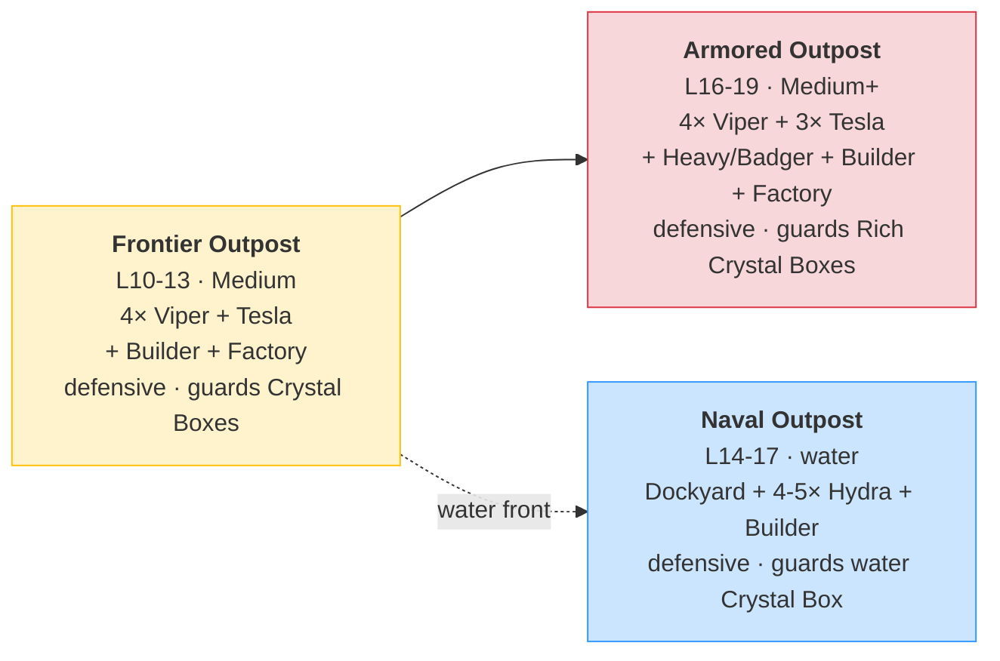
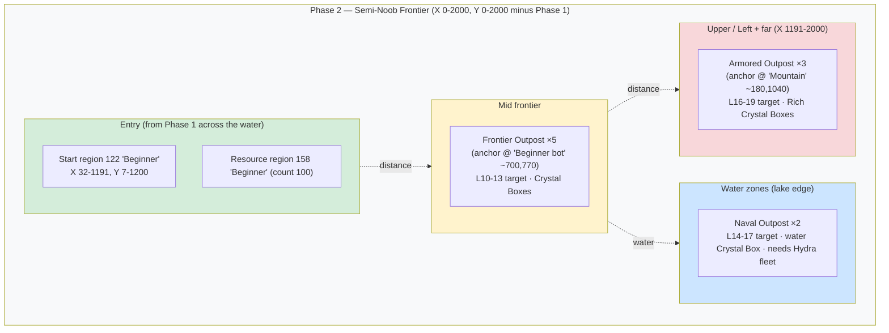

# Phase 2 Plan: Semi-Noob Frontier

> **Status:** Planning document. Source of truth for Phase 2 levels, units, crystals, boxes, bots, and quests.
> Live migration (razarion.com) happens iteratively, after Phase 1 is settled.
>
> **Related documents:** [`progression.md`](progression.md) — strategic multi-phase overview · [`phase-1-plan.md`](phase-1-plan.md) — the preceding phase (same format, shared unit roster).
>
> **Production audit:** §7 reflects a full read of live production (planet 117, server-game-engine 3) on **2026-05-31**. Headline: unlike Phase 1, Phase 2 is **almost entirely greenfield**. The Beginner start region, its resource field, and a crystal-dropping box type already exist, but **levels L11–L19, the Crystal unlock gating, the bot ground marker, and the stronger combat unit all still have to be built.**
>
> *Update 2026-06-04:* **L10 is now a real level (id 279)** with three quests (HARVEST, kill the (Bot2) Spire, BOX_PICKED), and the **first box region "Phase 2 Crystal Field"** is live (box id 2 renamed "Box", ttl 600 s, covering all of Phase 2). See §4 and §7.1. Box regions are no longer pending.
>
> **Bot naming convention:** **`(Bot1) X`** = the existing Phase-1 bot units (drop-free); **`(Bot2) X`** = the new drop-enabled Phase-2 variants (§4.1). Production internalNames are still **`(Bot) X`** today — rename `(Bot) X` → `(Bot1) X` is a pending cosmetic step bundled with the Phase-2 build (IDs unchanged; bot configs reference by ID).

---

## 1. Concept & Pacing

**Phase 2 region:** Semi-Noob Frontier — wraps around Noob Island (Phase 1) on the top and right.
- Coordinates: X 0–2000, Y 0–2000, **minus** the Phase 1 terrain zone (boundary in [`progression.md`](progression.md) §2). ~3.6 km².
- Live anchor: **start region 122 "Beginner"** (bbox X 32–1191, Y 7–1200) and **resource region 158 "Beginner"** (count 100). See §6 / §7.
- The player arrives here from Phase 1 by ferrying a Builder across the water (Phase 1 Q-transition, already live) and rebuilding a base from scratch in region 122.
- **Early combat capacity comes from a crystal unlock, not a free squad.** The Transporter only carries the Builder (`itemContainerType.ableToContain` = [1], maxCount 1). At **L11** the player unlocks **+3 Viper capacity** with the crystal found at the end of L10 — but can only build ~2 until a House is up (the house-space wall, §3). This is the opening beat of the Phase-2 gating loop.

**Gameplay identity:** Exploration & unlock. The headline mechanic is the **Crystal unlock**: new buildings and the stronger combat unit are no longer handed out by levelling — they must be unlocked by spending **Crystals found in boxes**. This turns Phase 2 into a treasure hunt and means two players at the same level can have different rosters.

**Bots** are stronger than Phase 1 and **defensive** (they guard a fixed realm and fight anyone who enters, but do not pursue beyond it). Each bot base sits on a visually distinct **bot ground** patch so the player can read "this spot is dangerous" at a glance.

**Duration:** 10 levels (L10–L19). Longer sessions than Phase 1; the player is now self-directing (explore → find crystals → unlock → push the next outpost). (Note: [`progression.md`](progression.md) §9 still lists Phase 2 as L10–L17 and Phase 3 starting at L18 — this plan extends Phase 2 to L19, so the Phase-3 boundary shifts; see §8.)

**Emotional arc per level block:**

| Block | Player feeling |
|---|---|
| L10–L11 | "I've left home and I'm rebuilding — what's out here?" |
| L12–L14 | "I'm finding crystals and unlocking new tech" |
| L15–L17 | "I have a real frontier army and I can crack the armored outpost" |
| L18–L19 | "I'm at the top of the frontier — max army, ready to move on" |

**New for Phase 2 (vs. Phase 1):**
1. **House** — raises the house-space cap (Phase 1 was hard-capped at 16 mobile units). Crystal-unlocked.
2. **Tesla** — first player static defense (lightning tower), for holding ground against the stronger defensive bots. A **new player unit that reuses the model3D and weapon config of the existing (Bot1) Tesla (id 5)**. Crystal-unlocked.
3. **Stronger combat unit** — a heavy land vehicle, tougher and harder-hitting than the Viper. Crystal-unlocked; built by the **existing Factory (4)** (no new producer building). **New content, must be created.**
4. **Crystals** — a second currency, earned only from boxes, spent only on unlocks (§3).
5. **Boxes** — spawn crystals (and optionally Razarion / XP) across the frontier (§4).
6. **Bot ground** — a ground/terrain marker under each bot base (§5).
7. **Rich resource** — a new resource node holding 5× the Razarion (harvested by the normal Harvester; no dedicated harvester), for longer mining runs in contested spots (§2.3).
8. **Additional power plant** — a crystal unlock for a **second Powerplant** (the existing generator, id 7), to power a multi-Tesla defense grid (§2). Makes power a soft constraint in Phase 2. No new building type.
9. **Naval front** — a water zone with a defensive Naval Outpost bot guarding a water crystal box (§2.4, §5.3). The player's carried-over Hydra fleet gets crystal **+Hydra capacity** unlocks to contest it (no new water unit).
10. **Bot box drops** — Phase-2 bot units drop crystal boxes when killed (§4.1), a second crystal source that makes fighting bots pay. Kept **off the Noob Island** via new Phase-2-only bot-unit variants.

---

## 2. Available Units & Buildings

**Carried over from Phase 1** (already unlocked, no crystals needed): Builder (1), Harvester (2), Viper (3), Factory (4), Radar (6), Powerplant (7), Dockyard (11), Hydra (12). The Transporter (18) is a one-way Phase-1→2 ferry and is not used inside Phase 2.

**New in Phase 2** — all gated behind Crystals (via `levelUnlockEntities`, see §3):

| ID | Name | Role | Razarion | Crystals | HP | DPS | Range | Built by | Status |
|---|---|---|---|---|---|---|---|---|---|
| 23 | House | +5 house space | 50 | 2 | 25 | – | – | Builder | exists, needs rebalance + crystal gate |
| — | **Tesla** *(new)* | Static defense (lightning) | 40 | 2 | 30 | 3 | 15 | Builder | ❌ new unit; clone model3D 48 + config from (Bot1) Tesla (5) |
| — | **Heavy unit** *(new)* | Strong combat vehicle | 30 | 2 | 20 | 10 | 12 | Factory (4) | ❌ must be created |

The L17 **+1 Powerplant** unlock is not a new type — it raises the cap on the existing **Powerplant (id 7)** by one (capacity unlock, §3), so it has no row here.

Plus a **new resource node** with 5× the content of the basic node — see §2.3.

**Glossary** (same as Phase 1): DPS = `weapon.damage / weapon.reloadTime`. Build time = `target.buildup / producer.progress` s.

**Notes:**
- **House** already exists in production (id 23, buildable by the Builder). It just carries un-migrated values (HP 300 / cost 300) and no crystal gate. Target HP 25 / cost 50 (the "reserved" values in [`phase-1-plan.md`](phase-1-plan.md) §7.1). House `houseType.space` = 5 → each House lifts the mobile-unit cap by 5, finally relaxing Phase 1's 16-unit ceiling.
- **Tesla** is the player static defense — a **new base item type** that **clones the (Bot1) Tesla (id 5)**: same `model3DId` (48) and the same LIGHTNING weapon config (HP 30, damage 6, reload 2 → DPS 3, range 15, `lightningDurationMs` 700). Because (Bot1) Tesla already sits at the Phase-1 combat scale (§2.1, the bot anchor), no weapon rebalance is needed — just clone it and set the player-side economy fields: `price` 40, a build buildup, and house-space consumption per player convention (gating is the L16 `levelUnlockEntities` entry, §3, not `unlockCrystals`). The old player **Tower (id 21) is dropped from Phase 2** (its projectile/HP values are off-scale); leave it reserved/unused. Note: a Tesla building HP 30 > House 25, consistent with "buildings > vehicles".
- **Stronger combat unit** does not exist on the player side. A heavy land vehicle model *does* exist on the bot side — **(Bot1) Badger (id 20)**, HP 250 / dmg 20 / range 20 / speed 20 — which can serve as the visual/role reference. The player version should be a slower, tankier brawler than the Viper. Proposed anchors in §2.1.
- **Heavy-unit producer:** no new producer building. Extend the existing **Factory (4)** `factoryType.ableToBuildIds` to include the heavy unit (currently builds 1/2/3). Keeps the asset count down and the build UI familiar.
- **Additional power plant (+1 Powerplant):** Phase-1 power = Powerplant (id 7, generator **200 W**) feeding the Radar (consumer **100 W**). Phase 2 turns power into a soft constraint by making the player **Tesla consume power** (e.g. ~100 W each — a divergence from the bot clone, which is free; see §8). One Powerplant covers the Radar + one Tesla; a **second Tesla** outstrips it, so the player unlocks a **second Powerplant** (capacity +1, the existing id 7 → 400 W total) at L17 to keep the grid powered. No new building type — just a `levelUnlockEntities` cap bump.

### 2.1 HP, Damage & Cost Anchors (proposed)

Phase 2 keeps the **Phase 1 anchors** (Viper = 10 Razarion, 10 HP, DPS 5) and scales the new content relative to them. All numbers below are **design proposals pending playtest**, mirroring the Phase 1 §2.1/§2.2 method.

**Heavy unit anchor — "2 Vipers' worth in one chassis, but slow":**

| Stat | Heavy unit | × Viper | Rationale |
|---|---|---|---|
| HP | 20 | 2.0 | = Builder HP; **stays below House (25)** to keep the "buildings > vehicles" principle |
| Razarion | 30 | 3.0 | premium land unit |
| Crystals | 2 | — | unlock cost |
| Damage | 10 (reload 1.0 → DPS 10) | 2.0 | hits twice as hard as a Viper |
| Range | 12 | 1.2 | slightly longer than Viper's 10 |
| Speed | 10 | 0.6 | slow brawler (vs. Viper 17) |

→ A heavy unit trades blows evenly with 2 Vipers but loses to 3; it out-ranges and out-tanks single Vipers, making it the unit that cracks a defended outpost. **Tension to resolve (§8):** HP 20 keeps "buildings > vehicles" intact, but a unit the player perceives as a "tank" may want more HP — if so, raise building HP across the board or accept the principle only holds through Phase 1.

**Tesla (player static defense):** no new anchoring needed — it clones **(Bot1) Tesla (id 5)**, which is already at the Phase-1 anchor scale: HP 30, damage 6, reload 2 → **DPS 3**, range 15, LIGHTNING. Set player economy fields only (price 40, crystal 3). A DPS-3 / range-15 lightning emplacement chips at 10-HP attackers without instakilling squads — the right strength for Phase 2. (The retired player Tower id 21 was dmg 30 / DPS 15 — far too strong at this scale, which is why it's dropped.)

**House:** target HP 25, cost 50, `space` 5 (unchanged).

### 2.2 Crystal Budget

The unlocks run on the fixed spine from §3 (the quests enforce the order). **All** unlocks — including the "type" ones — are `levelUnlockEntities` entries `{baseItemType, baseItemTypeCount, crystalCost}` (§3); from-scratch types just set base `itemTypeLimitation` 0 and a count-1 unlock. **Proposed crystal costs — tune in playtest:**

| Unlock | Level | Kind | Crystals |
|---|---|---|---|
| +3 Viper capacity | L11 | capacity | 1 |
| House | L12 | type | 2 |
| Heavy unit | L13 | type | 2 |
| +Heavy capacity (more combat) | L14 | capacity | 1 |
| House #2 | L15 | capacity | 2 |
| Tesla | L16 | type | 2 |
| +Tesla capacity | L17 | capacity | 1 |
| +1 Powerplant capacity | L17 | capacity | 2 |
| +combat capacity | L18 | capacity | 1 |
| House #3 | L19 | capacity | 2 |
| +Hydra capacity *(parallel naval track, §2.4)* | L14 | capacity | 1 |
| +Hydra capacity *(parallel naval track)* | L18 | capacity | 1 |
| **Total full kit** | | | **18 Crystals** |

At 1–3 crystals per box (§4) that's ~**10–14 box pickups** across the 10 levels — exploration is mandatory but not a grind. The spine order is enforced by the quests; the only real *choice* is when to grab the parallel naval track (+Hydra) versus pushing the land combat spine faster. (The rich resource, §2.3, is plain world content — no crystal unlock.)

### 2.3 Economy: rich resource

Phase 2's longer supply lines (§6) are paid for by a new, richer resource node — **5× the content of the basic node**:

| Resource | `amount` (content per node) | × basic | Status |
|---|---|---|---|
| "Noob" / Razarion (id 2, live) | 50 | 1.0 | ✅ exists |
| **Frontier Razarion** *(new)* | **250** | 5.0 | ❌ new resource item type (+ model) |

Each rich node holds five times the Razarion, so a single deposit fuels a long mining run — the right shape for a frontier where nodes sit far from base and often inside contested ground. Rich nodes are placed in **dedicated rich resource regions**, several of them next to / inside the bot grounds (§5), making the best economy a risk/reward push rather than a safe backyard.

Harvested by the **normal Harvester** (id 2) — there is **no dedicated/advanced harvester in Phase 2**. The rich resource is plain world content (not a crystal unlock); it just means richer nodes in contested spots.

### 2.4 Water / Naval track

Phase 2 has a **naval front** (§5.3, §6): a water zone with a defensive **Naval Outpost** bot guarding a water crystal box. Contesting it needs a Hydra fleet.

The player's water tech — **Dockyard (11)** + **Hydra (12)** — is **carried over** from Phase 1 (unlocked there at L6/L7), so a fresh Phase-2 base can build a Dockyard and a small Hydra fleet (base cap 3) from the start. Phase 2 adds **only Hydra capacity**, no new water unit and no re-gating of the Dockyard/Hydra types:

| Unlock | Level | Kind | Effect |
|---|---|---|---|
| +Hydra capacity | L14 | `levelUnlockEntities` | Hydra cap 3 → 5 |
| +Hydra capacity | L18 | `levelUnlockEntities` | Hydra cap 5 → 7 |

This mirrors the land +Viper / +combat capacity unlocks: the player has *some* navy from the start but must spend crystals to field a fleet big enough to crack the Naval Outpost. The Transporter (18) remains the one-way Phase-1→2 ferry and is not produced in Phase 2.

---

## 3. Crystal Unlock Mechanic

**How it works in the engine — verified in code 2026-05-31 (localhost):**
- **Crystals are a second currency** (per-user `UserEntity.crystals`), separate from Razarion. Earned **only from boxes**, spent **only on unlocks** — never on construction.
- **There is exactly ONE unlock mechanism: `LevelUnlockConfig`** (the editor/REST field is `levelUnlockEntities` on a level). Each entry is `{baseItemType, baseItemTypeCount, crystalCost}`. Buying it (`UserService.persistUnlockViaCrystals`) deducts `crystalCost` and adds `baseItemTypeCount` to the player's permanent `unlockedItemLimit[baseItemType]`.
- **Effective build limit** for an item = `level.itemTypeLimitation[item]` (base, by current level) **+** `unlockedItemLimit[item]` (sum of purchased unlocks). So:
  - A **type unlocked from scratch** (House, Tesla, Heavy unit) → set its `itemTypeLimitation` to **0/absent** and add a `LevelUnlockConfig {baseItemType, count: 1, crystalCost}`.
  - A **capacity bump** of an already-available type (+3 Viper, +Hydra, House #2) → just another `LevelUnlockConfig` with the extra `baseItemTypeCount`.
  - There is no separate "type vs capacity" distinction — it's all the same config.
- **⚠️ `BaseItemType.unlockCrystals` is NOT used by the engine** (serialized only, no game-logic consumer) — do **not** use it for gating. (The earlier draft of this plan wrongly used it.)
- **Box → crystals:** `boxItemType.boxItemTypePossibilities[].crystals` grants crystals on pickup. The live **"Box" (id 2)** grants **1 crystal**.
- **Quest hooks:** `QuestConfig.crystal` rewards crystals; triggers **`BOX_PICKED`** and **`UNLOCKED`** drive the quest arc (§7.4).

**What must be configured (none of it live yet) — all via `levelUnlockEntities` on the levels:**
1. From-scratch unlocks (base `itemTypeLimitation` 0 + a `LevelUnlockConfig` count 1): **House** (L12, cost 2), **Tesla** (L16, cost 2), **Heavy unit** (L13, cost 2).
2. Capacity bumps (`LevelUnlockConfig` with the extra count): **+3 Viper** (L11), **+Heavy** (L14), **House #2** (L15), **+Tesla** (L17), **+1 Powerplant** (L17), **+combat** (L18), **House #3** (L19), naval **+Hydra** (L14, L18).
3. Deploy box regions so crystals actually spawn (§4).
4. Optionally add a richer box type for guarded high-value drops (§4).

**Design intent:** unlocks are per-player and permanent. Two L14 players who found different boxes field different armies — the core "exploration over grinding" hook of Phase 2.

**The gating loop is the spine of all of Phase 2.** Every unlock follows the same four-beat rhythm — **find a box → spend crystals on an unlock → hit a capacity wall → collect more crystals for the next unlock** — and the whole phase is this loop repeated, escalating, with the *walls themselves* teaching what to unlock next. There are two walls:
- **House-space wall** — combat unlocks raise the unit cap, but you can't build them all until you unlock a **House** (+5 space).
- **Power wall** — multiple **Teslas** drain more than a single Powerplant supplies, so the grid runs short until you unlock a **second Powerplant** (+1 capacity, §2).

**Unlock spine (the order the quests enforce):**

| # | Level | Unlock | Wall it creates / relieves |
|---|---|---|---|
| 1 | **L11** | **+3 Viper** capacity | → house-space wall (only ~2 buildable) |
| 2 | L12 | **House** | relieves the wall (+5 space) |
| 3 | L13 | **Heavy unit** *(new combat unit)* | → house-space wall again (heavy units are big) |
| 4 | L14 | **more combat units** (+Heavy capacity) | → wall harder |
| 5 | L15 | **House #2** | relieves |
| 6 | L16 | **Tesla** | first static defense |
| 7 | L17 | **another Tesla** (+capacity) | → power wall (grid out-draws the Powerplant) |
| 8 | L17 | **+1 Powerplant** (capacity) | relieves the power wall |
| 9 | L18 | **+combat** (more combat units) | → house-space wall again |
| 10 | L19 | **House #3** | relieves — top-of-frontier army |

**L10 is the rebuild + first-crystal level (no unlock):** the player re-establishes a base and, at the **end of L10, finds a box** → first crystal. That crystal funds the **first unlock at L11: +3 Viper** — but only ~2 are buildable (house space full, no House yet), the **house-space wall** that teaches the loop; a collect-crystals quest points at more boxes; **L12** unlocks the House and the held-back Viper(s) go up. From there the same rhythm carries the player through the heavy unit, more capacity, the second House, the Tesla grid, the second Powerplant, and a final combat push + third House at L18–L19.

> The loop only works if each capacity unlock is genuinely partly blocked. Tune the Phase-2 house space (and power supply) so the player lands ~1 short after each combat unlock until the next House, and short on power once the Tesla grid grows — see §8. The rich resource (§2.3) sits *alongside* this spine as plain world economy content (not a crystal unlock).

---

## 4. Boxes

**BoxRegionConfig** (`update_box_regions`): `boxItemTypeId`, `minInterval`/`maxInterval` (respawn window, **seconds** — `ServerBoxRegionConfigEntity` stores them as seconds), `count` (concurrent boxes), `minDistanceToItems`, `region` (PlaceConfig). Note: `update_box_regions` is **not** id-preserving — each save recreates the region entities (ids churn), which is harmless since nothing references a box region by id.

**Box types:**

| Box | Contents | Status | Spawn | Count | Interval |
|---|---|---|---|---|---|
| Crystal Box | 1 Crystal | ✅ **live** (id 2 "Box", ttl 600 s) | region **"Phase 2 Crystal Field"** — all of Phase 2 | 10 | 30 s |
| Rich Crystal Box | 2–3 Crystals | ❌ new box type | Near outposts (guarded by bots) | 2 | 300–600 s |

Phase 2 boxes carry **only crystals**. A dedicated **resource (Razarion) box is deferred** — we'll add it later.

**Notes:**
- The **"Box"** type (id 2, 1 crystal) is the workhorse. **Live as of 2026-06-04:** deployed in a single Phase-2-wide region **"Phase 2 Crystal Field"** — the 0–2000 square minus the Phase-1 polygon (9-corner cut-out following the Phase-1 boundary; see [`progression.md`](progression.md) §2), `count` 10, 30 s respawn, `minDistanceToItems` 1. Boxes spawn anywhere on Phase-2 land. A finer split into scattered low-risk vs. guarded regions can come later.
- The Rich Crystal Box sits inside bot realms / next to bot ground — the player must beat or bait the defensive bot to claim it. This is the risk/reward core of the phase.
- `boxItemTypePossibilities` supports weighted tables (`possibility`) and `inventoryItemId`, so boxes can also carry inventory items / Razarion later — Phase 2 keeps it to crystals only.
- **First box region is live** — **"Phase 2 Crystal Field"** (box type 2, covering all of Phase 2). This was the first concrete Phase-2 build step. Remaining box work: the Rich Crystal Box type + guarded regions, and bot drops (§4.1).

### 4.1 Bot drops — a second crystal source (Phase 2 only)

Bot units can **drop a box when destroyed** via the base-item-type fields `dropBoxItemTypeId` (which box) + `dropBoxPossibility` (0–1 chance per kill). Phase 2 turns this on so **killing bot units yields crystals** — a second source alongside world boxes, which makes the ~10 bots and their larger compositions worth fighting and ties combat directly into the crystal economy.

**Constraint — keep it off Noob Island.** `dropBox*` lives on the **baseItemType**, not the bot config, and Phase 1 + Phase 2 currently share the same bot units (e.g. (Bot1) Viper id 16). Setting drops on those would also drop boxes on the Noob Island, which we do **not** want. Therefore:

- **Phase 2 uses new bot-unit variants** — clones of the Phase-1 bot combat units with `dropBoxItemTypeId` set (and optionally tougher stats, since "Phase-2 bots are stronger"). This is the **"more bot units"** the design needs.
- **Phase-1 bot units stay untouched** (`dropBoxItemTypeId = null`) → Noob Island remains drop-free.

**Proposed drops (tune in playtest):**

| Phase-2 bot unit (new variant) | Drops | Possibility |
|---|---|---|
| (Bot2) Viper | Crystal Box (1) | ~0.12 |
| (Bot2) Hydra | Crystal Box (1) | ~0.12 |
| (Bot2) Tesla | Crystal Box (1) | ~0.10 |
| (Bot2) Badger / heavy boss | Rich Crystal Box (2–3) | ~0.5 |

Bot **buildings** don't drop (they're quest targets, §7.4). Alternative to new unit types: a small engine change to move `dropBox*` onto the `BotItemConfig` (per-bot) — see §8.

---

## 5. Bots in Phase 2

Three bot **archetypes** (two land, one naval), deployed as **~10 instances** so the frontier feels populated and the player always has a next target. Each instance is pinned to a fixed location and marked by a **bot ground** patch. All **defensive** — stronger than Phase 1's passive camps: they actively engage anything inside their realm but never leave it. The Naval Outpost (§5.3) is a parallel water front, not part of the land escalation.

**Roster (~10 instances):**

| Archetype | Difficulty | Count | Where |
|---|---|---|---|
| Frontier Outpost | Medium (L10–13) | **5** | mid frontier — the bread-and-butter early targets |
| Naval Outpost | water (L14–17) | **2** | lake-edge water zones |
| Armored Outpost | Medium+ (L16–19) | **3** | deep/upper frontier (incl. the unused X 1191–2000 / Y 1200–2000) |

= **10 bots**. Spacing, not area, is the constraint (§6): ~334 000 m²/bot in the 3.34 km² region (≈3.5× the room-per-bot of Phase 1), so they fit with wide lanes for the player. Two live anchors already exist (bot **782** → a Frontier instance, bot **783** → an Armored instance); the other 8 are new.

**Combat units are the new drop-enabled Phase-2 variants** (§4.1): the (Bot2) Viper / Hydra / Tesla / Badger clones that drop crystal boxes on death (Phase-1 bot units stay drop-free). The compositions below list the Phase-1 reference IDs for clarity; the actual bots field the (Bot2) variants.

### 5.0 Bot Escalation Overview

### 5.1 Frontier Outpost (Medium) — Target L10–L13 · **×5**
- **Composition (each):** 4× (Bot1) Viper (16), 1× (Bot1) Tesla (5), 1× (Bot1) Builder (13), 1× (Bot1) Factory (15) — the (Bot1) Tesla (5) is the bot's static defense (same unit the player clones for their own Tesla)
- **Behavior:** Defensive — guards its realm, attacks intruders, does **not** pursue beyond the bot ground; Builder rebuilds losses
- **rePopTime:** ~120 s · **Enragement:** after 5 kills → +2 (Bot1) Viper
- **Placement:** 5 instances spread across the mid frontier — anchor one on live bot **782 "Beginner"** ~(700, 770) (currently a single Builder); 4 new ones fan out so several are within reach of the L10–13 player
- **Bot ground:** medium patch under each base

### 5.2 Armored Outpost (Medium+) — Target L16–L19 · **×3**
- **Composition (each):** 4× (Bot1) Viper, 3× (Bot1) Tesla, 1× **(Bot1) Badger (20)** *or* the new heavy unit (boss), 1× (Bot1) Builder, 1× (Bot1) Factory, 1× (Bot1) Powerplant
- **Behavior:** Defensive, strong static layer; the Badger/heavy boss anchors the defense
- **rePopTime:** ~100 s · **Enragement:** after 4 kills → +1 heavy unit
- **Placement:** 3 instances in the deep/upper frontier — anchor one on live bot **783 "Mountain"** ~(180, 1040) (currently empty); 2 new ones in the far unused space (X 1191–2000 / Y 1200–2000), guarding the Rich Crystal Boxes
- **Bot ground:** larger patch under each base

### 5.3 Naval Outpost (water) — Target L14–L17 · **×2**
- **Composition (each):** mirrors the Phase-1 "Noob water" bot (779): 1× (Bot1) Dockyard (9), 4–5× (Bot1) Hydra (10), 1× (Bot1) Builder (13), guarding a **water crystal box**
- **Behavior:** Defensive, realm-bound to the water zone; does not leave the water
- **rePopTime:** ~120 s · **Enragement:** after 4 kills → +2 (Bot1) Hydra
- **Placement:** 2 instances in the lake-edge water zones (§6) — **new bots**, production has no Phase-2 naval bot
- **Bot ground:** marking is harder on water (the bot ground is a land patch). Options: a water-edge land patch, a buoy/structure decal, or a tinted realm overlay — **see §8**

**Bot ground (the marker):** a visually distinct ground patch under each bot base so danger is legible from a distance. Production has only one ground config (252 "Sandy ground"), so the bot-ground material/region is **new content** (see [Bot Ground Visual Ideas] in project memory — diplomacy-colored border / hazard plateau). **Open question §8:** is "bot ground" a separate `groundConfig`, a terrain-object decal, or a colored realm overlay — and how is it shown on water (§5.3)?

---

## 6. Map Layout (Phase 2)

**Region:** X 0–2000, Y 0–2000 minus the Phase 1 box. Live geometry:

- The player lands from Phase 1 into **start region 122** and rebuilds. Resources are abundant nearby (**region 158**, count 100) but spread out — longer supply lines than Phase 1.
- Difficulty rises with distance: the Frontier Outpost (~700, 770) is the first push; the Armored Outpost (~180, 1040, "Mountain") is the late-phase wall guarding the best crystals.
- The **water zone** along the lake edge holds the **Naval Outpost** (§5.3) and a water Crystal Box — reachable only with a Hydra fleet, so the navy is a real second front, not decoration.
- Crystal boxes are scattered between the outposts; Rich Crystal Boxes sit inside the bot grounds.
- **Space check (~10 bots):** the 3.34 km² region gives ~334 000 m²/bot (a ~580×580 m cell each) — ~3.5× the room-per-bot of Phase 1. Area is not the constraint; the design goal is *staggering* difficulty by distance (5 Frontier near/mid, 2 Naval at the lake edge, 3 Armored far) with wide lanes so the player is never boxed in. The far quadrant (X 1191–2000 / Y 1200–2000) is currently empty and absorbs the Armored instances.
- Transitions out: to **Phase 3** across X = 2000 (east), to **Phase 4** across Y = 2000 (north) — see [`progression.md`](progression.md) §4.7.

---

## 7. Production Audit (2026-05-31)

Full read of live production: **planet 117**, **server-game-engine 3**, plus box/ground/item-type catalogs.

Status legend: ✅ exists & usable · ⚠️ exists but needs change · ❌ missing, must be created.

**Summary:** Phase 2 is mostly **greenfield**. The landing zone and a crystal box type exist; the unlock gating, the level ladder, the boxes-in-world, the bot ground, and the heavy unit do not.

### 7.1 What already exists

| Element | Production state | Status |
|---|---|---|
| Start region | **122 "Beginner"**, bbox X 32–1191 / Y 7–1200 (10 corners) | ✅ |
| Resource region | **158 "Beginner"**, resource #2, count 100, minDist 0, bbox X 4–1581 / Y 20–1479 | ✅ |
| Basic resource node | **resource item type id 2 "Noob"** — `amount` 50, LAND, radius 1 | ✅ (the 5× rich node scales off this) |
| Crystal box type | **box id 2 "Box"** (renamed from "Noob"; player name "Box") — drops **1 crystal**, ttl 600 s, LAND, radius 0.8 | ✅ **deployed** — region "Phase 2 Crystal Field" (§4) |
| Bot landing seed | **bot 782 "Beginner"** ~(700,770), `autoAttack=true`, 1× (Bot1) Builder | ⚠️ stub → anchor 1 of the 5 Frontier Outposts |
| Bot far seed | **bot 783 "Mountain"** ~(180,1040), empty realm | ⚠️ stub → anchor 1 of the 3 Armored Outposts |
| House building | **id 23** — HP 300 / cost 300, `space` +5, buildable by Builder | ⚠️ rebalance (→25/50 ✅ done on localhost) + gate via a L12 `levelUnlockEntities` entry |
| Tesla clone source | **(Bot1) Tesla id 5** — HP 30, dmg 6 / DPS 3, range 15, LIGHTNING, model3D 48 | ✅ source for the new player Tesla (clone config + model) |
| Player Tower | **id 21** — HP 259 / cost 250, dmg 30 / DPS 15 | dropped from Phase 2 (off-scale); reserved/unused |
| Heavy-unit reference | **(Bot1) Badger id 20** — HP 250 / dmg 20 / range 20 / speed 20 (bot-side only) | reference for the new player unit |

### 7.2 What is missing (must be built)

| Element | Status | Notes |
|---|---|---|
| **Levels L11–L19** | ❌ | **L10 (id 279) is now a real level** (`xp2LevelUp` 100) with quest group 26. **L11–L19 do not exist** — the rest of the ladder is still to build. |
| **L10 unlock + XP** | ⚠️ | `xp2LevelUp` is set (100), but item limits are still the **L9 set** and no House/Tesla/Heavy added to `itemTypeLimitation` yet. L10 carries no crystal unlock (it's the rebuild + first-box level). |
| **Crystal unlocks** (`levelUnlockEntities`) | ❌ | All levels carry empty `levelUnlockEntities`. Add one `LevelUnlockConfig {baseItemType, baseItemTypeCount, crystalCost}` per unlock (§3). From-scratch types (House/Tesla/Heavy) also need base `itemTypeLimitation` 0. |
| **Capacity unlocks** (`levelUnlockEntities`) | ❌ | The §3 spine: +3 Viper (L11), +Heavy (L14), House #2 (L15), +Tesla (L17), +1 Powerplant (L17), +combat (L18), House #3 (L19); plus the naval track +Hydra (L14, L18). None exist; levels carry empty `levelUnlockEntities`. |
| **Box regions** | ✅ | **Live (2026-06-04):** one region **"Phase 2 Crystal Field"** (box type 2, all of Phase 2, count 10, 30 s respawn). Finer/guarded regions still optional (§4). |
| **Rich Crystal Box type** | ❌ | Only the 1-crystal **"Box"** type (id 2) exists; a 2–3 crystal box is new. |
| **Bot ground** | ❌ | Only ground config **252 "Sandy ground"** exists. The bot-territory marker is new content. |
| **Player Tesla** | ❌ | New `baseItemType` cloning (Bot1) Tesla (id 5): same model3D 48 + LIGHTNING config; set player economy fields. Gated via a L16 `levelUnlockEntities` entry (count 1, cost 2) + base `itemTypeLimitation` 0. |
| **Stronger combat unit** | ❌ | No player heavy land unit exists; needs a new `baseItemType` (+ model). Built by extending Factory (4) `ableToBuildIds`. |
| **+1 Powerplant (power)** | ❌ | Capacity unlock raising Powerplant (id 7) cap to 2 at L17 (`levelUnlockEntities`). Meaningful only if the player Tesla consumes power (§2 / §8). No new building. |
| **Rich resource ("Frontier Razarion")** | ❌ | New resource item type, `amount` 250 (5× the live node's 50), + model; placed in new rich resource regions near the bots. Harvested by the normal Harvester (no dedicated harvester). |
| **Bot roster (~10 instances)** | ❌ | §5: **5 Frontier + 2 Naval + 3 Armored**. 2 live stubs (782, 783) anchor one Frontier + one Armored; the other **8 are new bots** — build out compositions, realms, bot grounds, and stagger by distance (§6). |
| **Naval Outpost bots (×2)** | ❌ | New water bots (§5.3) on the lake edge: each (Bot1) Dockyard (9) + (Bot2) Hydra ×4–5 + (Bot1) Builder, guarding a water Crystal Box. Production has no Phase-2 naval bot. |
| **Phase-2 bot-unit variants (drop-enabled)** | ❌ | §4.1: new `baseItemType` clones of the Phase-1 bot combat units — **(Bot2) Viper / Hydra / Tesla / Badger** — with `dropBoxItemTypeId` set (+ optionally tougher). The Phase-2 bots field these; Phase-1 bot units stay `dropBoxItemTypeId = null` so the Noob Island never drops. |
| **Bot drop config** | ❌ | Set `dropBoxItemTypeId` + `dropBoxPossibility` on the (Bot2) variants (Viper/Hydra/Tesla ~0.10–0.12 → Crystal Box; boss ~0.5 → Rich Crystal Box). |
| **Rename (Bot) → (Bot1)** | ❌ | Cosmetic: rename the 12 existing bot `baseItemType` internalNames `(Bot) X` → `(Bot1) X` so the live editor matches the (Bot1)/(Bot2) convention. IDs unchanged; bot configs reference by ID, so no functional impact. |
| **Water Crystal Box region** | ❌ | A box region on water (`terrainType` WATER) inside the Naval Outpost's realm. The **"Box"** type (id 2) is LAND-only — may need a WATER box variant. |
| **Phase-2 quest groups** | ⚠️ | **Quest group 26 now targets L10** (3 quests: HARVEST 30 · kill the (Bot2) Spire · BOX_PICKED — the "Find a Box" beat). L11–L19 quest groups still to build. |
| **Crystal resource node?** | n/a | Crystals come from boxes, not harvest nodes — no resource-item change needed (the single resource type #2 "Noob"/Razarion is sufficient). |

### 7.3 Level Limits (proposed, L10–L19)

Building on the frozen L9 set {Builder 1, Harvester 1, Viper 6, Factory 1, Radar 1, Powerplant 1, Dockyard 1, Hydra 3, Transporter 1}. New columns: House (23), Tesla (new), Heavy unit (new); the **Powerpl.** column is the existing Powerplant (id 7, unlocked +1 at L17) and **Hydra** is carried over (base cap 3) with crystal +capacity unlocks at L14/L18 (§2.4). The numbers are the **full cap after unlocks**; a "–" means locked until the crystal unlock at that level. **Proposal — tune in playtest:**

| Level | xp2Next | Builder | Harvester | Viper | Factory | House | Tesla | Heavy | Powerpl. | Hydra | unlock at this level |
|---|---|---|---|---|---|---|---|---|---|---|---|
| L10 | 1500 | 2 | 3 | 6 | 2 | – | – | – | 1 | 3 | — (rebuild; keep carried-over army; **end: find box**) |
| L11 | 2000 | 2 | 3 | **9** | 2 | – | – | – | 1 | 3 | **+3 Viper** (only ~2 buildable — house wall) |
| L12 | 2700 | 2 | 4 | 9 | 2 | 1 | – | – | 1 | 3 | **House** (relieves wall) |
| L13 | 3600 | 2 | 4 | 10 | 2 | 1 | – | **2** | 1 | 3 | **Heavy unit** *(new combat unit)* → house wall |
| L14 | 4800 | 3 | 4 | 12 | 3 | 1 | – | **4** | 1 | **5** | **more combat** (+Heavy) + **+Hydra** (navy) → house wall harder |
| L15 | 6400 | 3 | 5 | 12 | 3 | **2** | – | 5 | 1 | 5 | **House #2** (relieves) |
| L16 | 8500 | 3 | 5 | 14 | 3 | 2 | **1** | 6 | 1 | 5 | **Tesla** (first static defense) |
| L17 | 11000 | 3 | 6 | 16 | 3 | 3 | **2** | 8 | **2** | 5 | **+another Tesla** → power wall, **+1 Powerplant** relieves |
| L18 | 14000 | 3 | 6 | **18** | 3 | 3 | 2 | **10** | 2 | **7** | **+combat** (+Viper/+Heavy) + **+Hydra** (navy) → house wall |
| L19 | 18000 | 4 | 6 | 18 | 3 | **4** | 2 | 10 | 2 | 7 | **House #3** (relieves) |

The columns are the **full cap after that level's unlocks**; "–" = still locked. The progression follows the §3 spine exactly: combat capacity climbs (Viper → Heavy), each jump runs into the house-space wall until a House unlock relieves it, and the late Tesla grid (L16–L17) runs into the power wall until the +1 Powerplant (L17). **L10 is the rebuild + find-box level** (no unlock): the player arrives with the **carried-over Phase-1 army** (the live transition / quest Q400 repositions 2 Harvesters + 6 Vipers into region 122 → base Viper 6) and finds a box at L10's end; the first unlock **+3 Viper → cap 9** then lands at **L11**.

Item limits stop being the binding constraint here — **house space does**, gated by how many Houses the player has unlocked and built. The planet `itemTypeLimitation` caps (House 7, etc.) must be raised to cover these L18–L19 numbers (currently they cover only the Phase-1/L9 plan). **Verify before writing.**

### 7.4 Quests (proposed arc, L10–L19)

Implements the §3 gating-loop spine, with the parallel **naval (N#, §2.4/§5.3)** and **economy/harvest (E#, §2.3 — cumulative Razarion)** tracks woven in. **One table, ordered by level.** Each land unlock is preceded by a box/crystal beat and (for combat) followed by a house-space wall; the late Tesla grid hits the power wall. Rewards are XP + occasional Razarion/Crystal.

| # | Quest | Lvl | Track | Trigger            | Target                                             | Reward | Beat |
|---|---|---|---|--------------------|----------------------------------------------------|---|---|
| E1 | First Yield | L10 | eco | HARVEST            | 250 total                                          | 80 XP | bootstrap the economy |
| 1 | First Blood | L10 | land | SYNC_ITEM_KILLED   | 2 units (botId: Frontier Outpost)                  | 100 XP | first combat — take out Frontier bots |
| 2 | Find a Box | L10 (end) | land | BOX_PICKED         | ×1 box                                             | 50 XP, +1 Crystal | preps the L11 Viper unlock |
| 3 | Reinforcements | L11 | land | UNLOCKED           | +3 Viper capacity                                  | 100 XP | **wall:** only ~2 buildable (house full) |
| 4 | Crystal Cache | L11 | land | BOX_PICKED         | ×3 total                                           | 80 XP, +Crystals | preps the House unlock |
| 5 | Room to Grow | L12 | land | UNLOCKED           | House                                              | 100 XP | relieves → build held-back Viper(s) |
| 6 | Raze the Outpost | L12 | land | SYNC_ITEM_KILLED   | (Bot1) Factory (15) ×1 (botId: Frontier Outpost)   | 200 XP, 150 Razarion, 2 Crystals | bot-only building → crack the outpost |
| 7 | Heavy Metal | L13 | land | UNLOCKED           | Heavy unit *(new combat unit)*                     | 150 XP | **wall:** big units, house fills again |
| N1 | Set Sail | L13 | naval | SYNC_ITEM_CREATED  | Dockyard ×1                                        | 100 XP | re-establish water tech (carried over) |
| 8 | War Machines | L14 | land | UNLOCKED           | +Heavy capacity (more combat)                      | 150 XP | **wall harder** |
| N2 | Naval Force | L14 | naval | UNLOCKED           | +Hydra capacity                                    | 100 XP | fund a real fleet |
| E2 | Rich Seams | L14 | eco | HARVEST            | 1500 total                                         | 150 XP, +1 Crystal | pays off at the rich nodes |
| 9 | Room to Grow II | L15 | land | UNLOCKED           | House #2                                           | 150 XP | relieves the combat wall |
| N3 | Clear the Waters | L15 | naval | SYNC_ITEM_KILLED   | (Bot1) Dockyard (9) ×1 (botId: Naval Outpost)      | 250 XP, 200 Razarion, 2 Crystals | bot-only building → needs a Hydra fleet |
| 10 | Hold the Line | L16 | land | UNLOCKED           | Tesla                                              | 100 XP | first static defense |
| 11 | Static Grid | L17 | land | UNLOCKED           | +Tesla capacity (another Tesla)                    | 100 XP | **wall:** grid out-draws the Powerplant |
| 12 | More Power | L17 | land | UNLOCKED           | +1 Powerplant                                      | 200 XP | relieves the **power wall** |
| 13 | War Host | L18 | land | UNLOCKED           | +combat capacity                                   | 150 XP | **wall:** more units, house fills |
| 14 | Armored Assault | L18 | land | SYNC_ITEM_KILLED   | (Bot1) Powerplant (14) ×1 (botId: Armored Outpost) | 400 XP, 300 Razarion, 3 Crystals | bot-only building behind the boss |
| N4 | High Tide | L18 | naval | UNLOCKED           | +Hydra capacity                                    | 100 XP | top-end fleet |
| E3 | Razarion Baron | L18 | eco | HARVEST            | 6000 total                                         | 250 XP, 2 Crystals | late economy mastery |
| 15 | Room to Grow III | L19 | land | UNLOCKED           | House #3                                           | 150 XP | relieves — top-of-frontier army |
| 16 | Frontier Champion | L19 | land | SYNC_ITEM_KILLED   | 15 units (any bot)                                 | 500 XP, 300 Razarion | phase capstone |

**Notes:**
- **Capacity unlocks (Q3, Q8, Q9, Q11, Q12, Q13, Q15; N2, N4)** are `levelUnlockEntities`, not new types (§3). Tune the house space so each combat unlock is partly blocked until the next House, and the power supply so the second Tesla (Q11) is unpowered until the +1 Powerplant (Q12).
- The **naval track runs in parallel** with the land spine (like the harvest economy track) — a player can skip it, but the water Crystal Box (N3 reward + the box itself) rewards contesting the Naval Outpost.
- The **harvest track (E1–E3)** uses the `HARVEST` trigger (already proven in Phase 1 production). Re-check the cumulative targets against the live `Harvester.progress` and rich-node `amount` once those are set — they scale the time-to-target directly.
- **Bot objectives use `SYNC_ITEM_KILLED`** (+ `botIds[]` to scope to one outpost), matching live Phase-1 production — not `BASE_KILLED`. Two flavours:
  - **Destroy a bot-only building** (Q6 → (Bot1) Factory 15, Q14 → (Bot1) Powerplant 14, N3 → (Bot1) Dockyard 9). These building types are **never buildable by the player** (the player builds the differently-IDed Factory 4 / Powerplant 7 / Dockyard 11), so the target is unambiguous and forces the player to penetrate the outpost's defenders to reach it.
  - **Kill a unit count** scoped to one outpost (Q1 → 2 Frontier Outpost units, the L10 first-combat beat) or the broad capstone (Q16 → 15 units, any bot).
  - Tune for whether a surviving (Bot1) Builder rebuilds the destroyed building (which could reset the objective) — may need `noRebuild` on the quest-target building.

---

## 8. Open Questions

1. **Power as a constraint:** the +1 Powerplant unlock only matters if something new draws power. Plan of record: make the player **Tesla a power consumer** (~100 W each). The Phase-1 Powerplant supplies 200 W and the Radar already draws 100 W, so one Powerplant covers the Radar + one Tesla; a **second Tesla** (Q12) tips demand to ~300 W and the **+1 Powerplant** (Q13, → 400 W) relieves it. Confirm Tesla should cost power (diverging from the free bot clone). If nothing consumes, drop the +1 Powerplant unlock. (Heavy-unit producer is settled: extend the existing **Factory (4)**, no new building.)
2. **Heavy-unit HP vs. "buildings > vehicles":** HP 20 keeps the Phase-1 principle (House 25 > all vehicles), but a "tank" may want to feel tankier. Raise building HP across the board, or let the principle lapse after Phase 1?
3. **Bot ground — what is it technically?** A new `groundConfig`, a terrain-object decal, or a colored diplomacy overlay on the bot realm? Affects how it's authored. See [Bot Ground Visual Ideas] in project memory.
4. **Player Tesla cloning:** the static defense is a new unit cloning (Bot1) Tesla (id 5) — same model3D 48 + LIGHTNING config (DPS 3 / range 15), so no weapon rebalance is needed. Confirm the clone can be a *buildable player building* (consumes house space? friendly-fire? placement rules) and that reusing model3D 48 on a player unit renders correctly. The old player Tower (id 21) is dropped — decide whether to delete it or leave it reserved.
5. **Bot behavior:** Phase-2 bots are "defensive" (engage in realm, don't pursue). Production's seed bots 782 run `autoAttack=true` — does that already mean realm-bound aggression, or do they chase? Verify the realm-clamping behavior.
6. **Crystal economy tuning:** ~18 crystals for the full spine (§2.2) vs. ~10–15 box pickups across 10 levels — too generous or too grindy? Needs playtest; adjust box `count`/`interval` and per-box crystal counts.
7. **L10 boundary:** L10 is currently a terminal cap. Does promoting it to a real level interfere with anything reading "max level reached" off id 279? Check before editing.
8. **Phase boundary L17 vs L19:** this plan extends Phase 2 to **L10–L19** (10 levels), but [`progression.md`](progression.md) §2/§9 defines Phase 2 as L10–L17 and Phase 3 ("The Siege") starting at **L18**. Decide: shift the Phase-3 start to L20 (and renumber the whole back half), or keep Phase 3 at L18 and treat L18–L19 here as a transition overlap. Update progression.md once decided.
9. **Phase-2 → 3/4 transitions:** mechanism TBD (level gate? another transporter?). Out of scope for this doc; tracked in progression.md §4.7.
10. **Rich resource per-trip behaviour:** rich nodes (`amount` 250) are harvested by the normal Harvester (no dedicated harvester in Phase 2). Decide whether a rich node yields more per trip or simply lasts ~5× longer — depends on how harvest capacity per trip is modelled.
11. **House-space wall at L11 (the gating loop's pivot):** for the +3 Viper unlock to be only ~2 buildable (§3), the Phase-2 base house space must be tight at L11. Tune which: the planet/base `houseSpace`, the L11 item limits, or the assumed unit composition — so the player lands exactly ~1 short until the House unlocks at L12. Verify house space is per-base (a fresh Phase-2 base) and not a single planet-wide pool shared with the Phase-1 base.
12. **Bot drops without touching Noob Island (§4.1):** plan of record is **new (Bot2) unit variants** with `dropBoxItemTypeId` set, so the shared Phase-1 bot units stay drop-free. The cheaper alternative is a small **engine change** — move `dropBoxItemTypeId`/`dropBoxPossibility` onto `BotItemConfig` (per-bot-instance) so one unit type can drop in Phase 2 but not Phase 1. Decide content-only (variants, more assets) vs. engine change (one-time code, fewer item types) before building. Also tune drop rates so crystals-from-combat don't trivialise the box economy (§2.2).

---

## 9. Build Sequence (Proposal)

Phase 2 is greenfield, so the order is **build, not migrate**. The layers follow the §3 unlock spine; the naval track (§2.4) is woven in alongside. One mini-iteration per layer: configure → warm-restart → play → tune.

1. **Foundation — the crystal + House loop (L10–L12)**
   - Promote L10 (id 279): real `xp2LevelUp`, raised item limits. **L10 carries no unlock** — it's the rebuild + first-crystal level (Find a Box at L10's end preps the L11 Viper unlock).
   - Author the **+3 Viper** capacity unlock at **L11** (`levelUnlockEntities`) and tune the L11 house space tight (§8.10) so only ~2 are buildable until the House.
   - Rebalance **House** (HP 25 / cost 50 ✅ done). Gate House via a `levelUnlockEntities` entry on **L12** (count 1, cost 2) + base `itemTypeLimitation` 0.
   - Deploy **Crystal Box regions** (existing box id 2) scattered in region 122's reachable area.
   - Create the **drop-enabled (Bot2) unit variants** (Viper/Hydra/Tesla/Badger clones with `dropBoxItemTypeId`, §4.1) — the Phase-2 bots field these; Phase-1 bot units stay untouched.
   - Build the **5 Frontier Outposts** (§5.1) from the (Bot2) variants + bot grounds, staggered across the mid frontier (anchor one on live bot **782 "Beginner"**) — needed for Q1 (kill 2 Frontier bot units) and Q6 (kill the (Bot1) Factory).
   - Create levels L11–L12. Quests **Q1–Q6** (First Blood → Find a Box → Reinforcements → Crystal Cache → Room to Grow → Raze the Outpost) + harvest **E1** (First Yield).
   - Warm-restart, test the find→unlock→wall→find loop end-to-end.

2. **Combat + economy (L13–L14)**
   - Create the **stronger combat unit** (model + base item type + anchors §2.1); extend **Factory (4)** `ableToBuildIds` to build it. Gate via a **L13** `levelUnlockEntities` entry (count 1, cost 2) + base `itemTypeLimitation` 0.
   - Author the **+Heavy capacity** unlock (**L14**, `levelUnlockEntities`) — runs into the house wall again.
   - Create the **rich resource** ("Frontier Razarion", `amount` 250) + **rich resource regions** near the bot grounds (§2.3) — harvested by the normal Harvester, no dedicated harvester. Create the **Rich Crystal Box** type, deploy guarded.
   - **Naval:** build the **2 Naval Outposts** (§5.3) in the lake-edge water zones + water markers, a **water Crystal Box** region in each realm, and the **+Hydra** capacity unlock (**L14**). (Dockyard/Hydra are carried over, no new types.)
   - Create levels L13–L14. Quests **Q7–Q8** (Heavy Metal, War Machines) + naval **N1–N2** (Set Sail, Naval Force) + harvest **E2** (Rich Seams).

3. **Second House (L15)**
   - Author the **House #2** capacity unlock (`levelUnlockEntities`). Create level L15. Quest **Q9** (Room to Grow II) + naval **N3** (Clear the Waters — kill the Naval Outpost).

4. **Defense + power (L16–L17)**
   - Create the player **Tesla** by cloning (Bot1) Tesla (id 5) — model3D 48 + LIGHTNING config — set player economy fields **incl. power consumption** (§8.1). Gate via a **L16** `levelUnlockEntities` entry (count 1, cost 2) + base `itemTypeLimitation` 0. Author the **+Tesla capacity** unlock (**L17**).
   - Author the **+1 Powerplant** capacity unlock (**L17**, `levelUnlockEntities`) — relieves the power wall the second Tesla creates. No new building.
   - Build the **3 Armored Outposts** with the Badger/heavy boss (§5.2) + bot grounds in the deep/upper frontier (anchor one on live bot **783 "Mountain"**).
   - Create levels L16–L17. Quests **Q10–Q12** (Hold the Line, Static Grid, More Power).

5. **Top of the frontier (L18–L19)**
   - Author the **+combat** capacity unlock (**L18**), the naval **+Hydra** unlock (**L18**), and **House #3** (**L19**) via `levelUnlockEntities`.
   - Create levels L18–L19; raise planet caps to cover the L19 set (incl. Hydra 7).
   - Quests **Q13–Q16** (War Host, Armored Assault, Room to Grow III, Frontier Champion) + naval **N4** (High Tide) + harvest **E3** (Razarion Baron).

6. **Balancing pass**
   - Only after the content exists: tune crystal drop rates, the two walls (house space, power), the naval fleet sizing, heavy-unit/Tesla stats, and the XP curve from real play.
