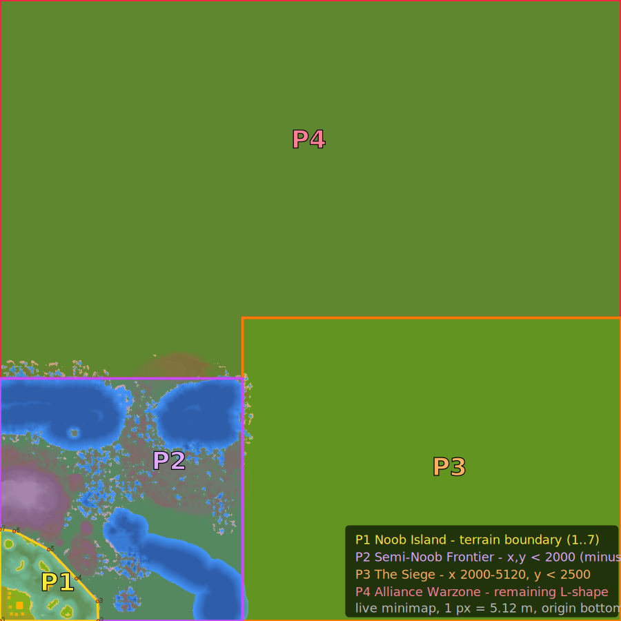

# Razarion Game Progression Design

This document defines the game flow, progression, and content design for Razarion. It serves as the source of truth for AI-driven content creation via the razarion-ai-content MCP server.

## 1. Game Concept

**Genre:** Browser-based multiplayer Real-Time Strategy (RTS) with a persistent shared world.

**Setting:** All units in the game are robots/machines — there are no human soldiers. Players command fleets of autonomous bots on a mechanized battlefield.

**Core Loop:** Harvest resources → Build base → Deploy units → Complete quests → Fight bots/players → Level up → Unlock new units/buildings → Repeat

**Player Goal:** Build and expand a base on a shared persistent planet, progress through four distinct map phases — from a safe beginner island to competitive alliance warfare.

**Session Length:** Designed for short sessions (10-20 min), with long-term progression across sessions.

---

## 2. Map Phases Overview

The planet is divided into **four geographic phases**. Each phase has its own gameplay identity, bot behavior, unlock mechanics, and difficulty. Players progress from Phase 1 to Phase 4 by leveling up. The phases are physically separated areas on the map.

All four phases over the live planet minimap (5120 × 5120 m, origin bottom-left, Y up) — **Phase 1** as the terrain-derived polygon (corners in "Phase 1 boundary" below), **Phase 2–4** as their rectangle / L-shape regions:



*(If the SVG doesn't render inline, open [`assets/phase1-boundary.svg`](assets/phase1-boundary.svg) directly — it embeds the minimap + the phase regions.)*

### Phase Coordinates

| Phase | Region (game coords, origin bottom-left, Y up) | Area |
|-------|------------------------------------------------|------|
| 1 — Noob Island | **terrain polygon**, 7 corners (see "Phase 1 boundary" below) | ~0.43 km² |
| 2 — Semi-Noob Frontier | X, Y < 2000, **minus** Phase 1 | ~3.6 km² |
| 3 — The Siege | X 2000–5120, Y < 2500 | 7.80 km² |
| 4 — Alliance Warzone | the remaining **L-shape** (everything above P2/P3) | ~14.4 km² |

**Phase boundary logic** (evaluated in order):
1. Inside the **Phase-1 terrain polygon** (corners below) → **Phase 1**
2. X < 2000 and Y < 2000 → **Phase 2**
3. X ≥ 2000 and Y < 2500 → **Phase 3**
4. Everything else → **Phase 4**

### Phase-1 boundary from the live minimap (terrain-derived)

Read from the live planet minimap (`PlanetEntity.miniMapImage`, planet 117, served at `GET /rest/image/minimap/117`). Saved here: [`assets/planet1-minimap.png`](assets/planet1-minimap.png) — 1000×1000 px over the 5120 m planet → **5.12 m/px**. The actual Phase-1 zone is walled in by terrain, not a clean rectangle:

- **North:** the mountain massif (x ≈ 0–520, south edge y ≈ 790–840) walls Phase 1 off.
- **East:** the Phase-1 lake's far shore — ~810 m at the bottom (y≈0), narrowing to a **waist ~630 m at y≈350**, then curving back in toward the mountain. The naval bot (RazCore Platform, ~(402, 282)) sits in this lake.
- **West / South:** the planet edges (x = 0, y = 0).

**Terrain-derived Phase-1 boundary (game coords, origin bottom-left, Y up):**

| # | X | Y |
|---|-----|-----|
| 1 | 0 | 0 |
| 2 | 810 | 0 |
| 3 | 804 | 162 |
| 4 | 630 | 350 |
| 5 | 402 | 589 |
| 6 | 117 | 740 |
| 7 | 0 | 756 |

The boundary is drawn over the minimap in the map at the top of this section (the yellow **P1** polygon). The **NE corner is cut off** vs. a square — the `(820, 800)` corner is not Phase-1 land but Phase-2 water across the lake; that square corner was the *"spike of Phase 1 reaching into Phase 2"*, removed by following the lake + mountain.

> Derived by sampling the minimap at 5.12 m/px; coordinates are approximate (±~15 m). This is **documentation only** — the server start regions (121/122) are not changed.

### Phase Transition

Players transition between phases by reaching a required level. The transition is **not automatic** — the player must actively choose to leave.

**Phase 1 → Phase 2:** at **Level 8** the player unlocks the **Transporter** to ferry a Builder across the water to the Phase 2 region; at **Level 9** a sequence of quests sells the old base and repositions the economy into Phase 2 (starting capital + frees the island for new players) — a clean "leaving home" moment. Mechanics live in [`phase-1-plan.md`](phase-1-plan.md) §5.

**Later transitions** (Phase 2→3, 3→4): Mechanism TBD (may also use Transporters or other gating mechanics).

| Phase | Levels | Theme | Bot Behavior |
|-------|--------|-------|-------------|
| 1 - Noob Island | 1-9 | Safe tutorial & early growth | Passive, only fights back when attacked |
| 2 - Semi-Noob Frontier | 10-17 | Exploration & unlock | Defensive outposts, guards territory |
| 3 - The Siege | 18-24 | Survival & defense | Bots actively attack player bases |
| 4 - Alliance Warzone | 25+ | PvP & diplomacy | Bots can be allied, player conflict focus |

---

## 3. Phase 1: Noob Island

> **Full spec → [`phase-1-plan.md`](phase-1-plan.md)** (the live localhost config: units, economy, levels, bots, quests, map). Phase 1 is built and playable.

A safe, isolated tutorial area where new players learn the game over **9 levels (L1–L9)**. Bots are mostly passive (two are aggressive within their realm), resources are abundant, and quests guide the player through every basic mechanic — harvest, build, fight — and finally ferry a Builder across the water to Phase 2. All unit/level/quest/bot/map detail lives in the plan doc; this overview only places Phase 1 in the overall arc (see §2 and the difficulty curve in §10).

---

## 4. Phase 2: Semi-Noob Frontier

> **Full spec → [`phase-2-plan.md`](phase-2-plan.md)** (production-grounded config with real unit IDs: Crystal unlocks, boxes, bots, quests, levels, map).

Players leave Noob Island for a larger, more dangerous frontier. The headline mechanic: **buildings and the stronger combat unit are unlocked by spending Crystals found in boxes**, not by leveling — turning Phase 2 into a treasure hunt where two players at the same level can field different rosters. Defensive bots on visible bot-ground patches guard the best crystals; killing bot units can also drop crystals. All unit/crystal/box/bot/quest/map detail lives in the plan doc.

### 4.1 Phase 2 Sub-Regions

Phase 2 is divided into **four progression sub-regions**, built out over time. Only **Sub-region 1** is defined now; **Sub-regions 2–4** are future content (L14+) and will be added later as simple axis-aligned rectangles (AABBs) in the remaining Phase-2 area.

**Sub-region 1 — "Bridgehead" (L10–L13).** The arrival zone: the player always crosses from Phase 1 (Noob Island) into Sub-region 1, which wraps the island on its north and east. It holds the entire current L10–L13 content (Beginner spawn, crystal boxes, Razarion fields, the Spire and Badger bots). Because it must exclude the island, it is **not an AABB**.

- **Outer rectangle:** X 0–850, Y 0–1150 (top-left (0,1150), bottom-right (850,0))
- **Minus** the Noob Island polygon (Phase 1) → non-AABB
- **Area:** ~0.55 km² (0.98 km² rectangle − 0.43 km² island)
- **Polygon** (game coords, origin bottom-left, Y up, CCW):

  | # | X | Y | note |
  |---|-----|------|------|
  | 1 | 810 | 0    | island leaves the south edge |
  | 2 | 850 | 0    | rectangle SE |
  | 3 | 850 | 1150 | rectangle NE |
  | 4 | 0   | 1150 | rectangle NW |
  | 5 | 0   | 756  | island reaches the west edge |
  | 6 | 117 | 740  | island boundary … |
  | 7 | 402 | 589  | |
  | 8 | 630 | 350  | |
  | 9 | 804 | 162  | back toward corner 1 |

> **Content rescope (follow-up):** the resource (id 218), box (id 11) and Beginner-start (id 122) regions currently span x≈0–1191 / y≈0–1200 — **wider than Sub-region 1**. They must be clipped to the Sub-region 1 polygon so L10–L13 content spawns only inside it.

**Graphic representation:** each sub-region is surfaced as a **ground-colour tint** (see [terrain-rendering.md](../architecture/terrain-rendering.md)). The tint is derived in `ground-material.ts` from world XZ and multiplied over `diffuseFinal` before the light block — keeping the sandy base and only shifting hue. Sub-region 1 ("Bridgehead") uses a warm welcoming green `(1.00, 1.03, 0.93)`; Sub-regions 2–4 get their tints when defined. The non-rectangular island edge of Sub-region 1 needs a small zone mask (the later AABB sub-regions can be done analytically).

These sub-regions are mirrored in the razarion-ai-content MCP server (`P2_SUBREGIONS` in `src/index.ts`) and can be overlaid on the live map with `region_map_image(subregions: true)` for verification.

---

## 5. Phase 3: The Siege

### 5.1 Concept

A fundamental shift in gameplay. In Phases 1 and 2, bots were passive or defensive — players chose when to fight. **In Phase 3, bots actively attack player bases.** This creates a survival/defense dynamic where players must:

- Build strong defenses (towers, walls)
- Maintain a standing army to repel attacks
- Manage economy under pressure
- Optionally cooperate with nearby players for mutual defense

The bot aggression is periodic (wave-based), giving players time to recover and build between attacks.

### 5.2 New Units & Buildings

| Name | Role | Unlocked At | Cost | Health | Notes |
|------|------|-------------|------|--------|-------|
| **Artillery** | Long-range siege | Level 18 | 150 Razarion | 100 | Long range, fragile |
| **Fortified Tower** | Heavy defense | Level 18 | 120 Razarion | 400 | Stronger tower variant |
| **Repair Station** | Heals nearby units | Level 21 | 100 Razarion | 200 | Passive area heal |

### 5.3 Bot Behavior: Attack Waves

Unlike Phases 1-2, bots in Phase 3 **actively send attack waves** against nearby player bases.

**Siege Bot (Aggressive)**
- Composition varies by wave:
  - Wave 1: 4 Razabots, 2 Razascouts
  - Wave 2: 6 Razabots, 2 Tanks
  - Wave 3: 4 Razabots, 3 Tanks, 1 Artillery
- Behavior: **Aggressive** — periodically sends units to attack nearest player base
- Attack interval: Every 5-10 minutes (minActiveMs/maxActiveMs)
- Between waves: Rebuilds forces at home base (minInactiveMs/maxInactiveMs)
- Enragement: Escalates wave composition when player destroys bot units

**Siege Fortress (Hard)**
- Composition: 6 Razabots, 4 Tanks, 2 Artillery, 3 Fortified Towers
- Behavior: **Aggressive** — sends large attack waves AND has strong home defense
- Attack interval: Every 8-15 minutes
- Enragement: After losing 5 units → next wave includes +2 Tanks; After losing 10 → adds Artillery

### 5.4 Defense Mechanics

Players need to think about:
- **Tower placement**: Covering approaches to their base
- **Chokepoints**: Using terrain to funnel attackers
- **Standing army**: Keeping units alive between waves, not just building when attacked
- **Economy under siege**: Harvesters may be targeted, requiring escort or protection

### 5.5 Quests

| # | Quest Name | Objective | Condition | Reward |
|---|-----------|-----------|-----------|--------|
| 1 | Brace Yourself | Build 2 Fortified Towers | SYNC_ITEM_CREATED: Fortified Tower x2 | 200 XP, 150 Razarion |
| 2 | First Defense | Survive a bot attack wave (kill 5 attackers) | SYNC_ITEM_KILLED: x5 (botId: Siege Bot) | 250 XP |
| 3 | Artillery Line | Build 2 Artillery | SYNC_ITEM_CREATED: Artillery x2 | 200 XP, 100 Razarion |
| 4 | Siege Breaker | Destroy a Siege Bot base | BASE_KILLED: x1 (botId: Siege Bot) | 400 XP, 300 Razarion |
| 5 | Fortress Storm | Destroy a Siege Fortress | BASE_KILLED: x1 (botId: Siege Fortress) | 600 XP, 500 Razarion |
| 6 | Repair Protocol | Build a Repair Station | SYNC_ITEM_CREATED: Repair Station x1 | 300 XP |

### 5.6 Map Layout

- **Region:** X: 2000–5120, Y: 0–2500, 3120 x 2500 m = 7.80 km²
- Located to the right of Phase 2, separated by terrain barriers along X=2000
- Harsh, contested territory
- Fewer safe spots — players must create their own safety through defense
- Siege Bot bases are positioned to threaten multiple player build areas
- Resource nodes exist but are in exposed locations (risk/reward)
- Narrow corridors and defensive terrain features encourage smart base placement

---

## 6. Phase 4: Alliance Warzone (Open Design)

> **Status: Early concept — many details TBD**

### 6.1 Vision

The endgame phase where the game transitions from PvE to PvP. Key ideas:

- **Bot alliances**: Players can ally with certain bot factions. The allied bot provides support units and defends the player, but expects the player to fight its enemies (rival bots and their allied players)
- **Guild system**: Players form guilds for coordinated attacks, shared defense, and territory control
- **Territory control**: Guilds compete to control resource-rich zones
- **Player vs Player**: The primary conflict is between players/guilds, with bots as allies rather than primary enemies

### 6.2 Bot Alliance Mechanic (Concept)

- Several bot factions exist in Phase 4, each controlling territory
- A player can choose to ally with ONE faction
- Allied bots:
  - Stop attacking the player
  - Provide support units during attacks
  - Share territory (player can build in bot realm)
- In return, the player is expected to fight rival factions (and their allied players)
- Switching alliances has a cooldown and costs resources

### 6.3 Guild Mechanics (Concept)

- Players form guilds (exact implementation TBD)
- Guild benefits:
  - Shared defense: Guild members' bases reinforce each other
  - Coordinated attacks: Quest rewards for guild-wide objectives
  - Territory bonuses: Guilds controlling a zone get resource bonuses
- Guild wars: Guilds can formally declare war, enabling base attacks between members

### 6.4 Open Questions

- How does alliance switching work? Cooldown? Cost?
- How are guild territories defined? Fixed zones or dynamic borders?
- What prevents a dominant guild from snowballing?
- Are there NPC quests in Phase 4, or is it purely player-driven?
- How do new Phase 4 players survive against established guilds?
- What new units/buildings are specific to Phase 4?
- How does the bot alliance affect the economy?

### 6.5 Map Layout (Concept)

- **Region:** L-shaped — X: 0–5120, Y: 2500–5120 plus X: 0–2000, Y: 2000–2500, ~14.42 km²
- Largest area on the map (above Phase 2 and Phase 3)
- Multiple bot faction territories
- Rich resource zones at contested borders between factions
- Open terrain favoring large army battles
- Guild "capitals" — defensible positions for guild HQs

---

## 7. Units & Buildings (Phase 3+ design)

> Phase 1 and Phase 2 rosters live in their plan docs ([`phase-1-plan.md`](phase-1-plan.md) §2, [`phase-2-plan.md`](phase-2-plan.md) §2) — those are the live/real units. The tables below are the **design-stage** roster for the not-yet-built Phase 3 (and Phase 4); names and values are placeholders pending a Phase-3 plan.

### 7.1 Buildings (Phase 3, design)

| Name | Role | Unlock Method | Cost (Razarion) | Health |
|------|------|--------------|-----------------|--------|
| Fortified Tower | Heavy defense | Level 18 | 120 | 400 |
| Repair Station | Area heal | Level 21 | 100 | 200 |

### 7.2 Units (Phase 3, design)

| Name | Role | Unlock Method | Cost | Health | Speed | Weapon |
|------|------|--------------|------|--------|-------|--------|
| Artillery | Long-range siege | Level 18 | 150 | 100 | Very slow | Very strong |

### 7.3 Balance Philosophy (cross-phase)

- Phase 1 units are cheap and fast but individually weak (detail in phase-1-plan).
- Phase 2 introduces specialization through crystal unlocks — not everyone has the same army.
- Phase 3 requires balanced army composition (pure offense fails against waves).
- No single unit should dominate; hard counters should exist between roles (fast vs. artillery, armor vs. light).
- Buildings should be affordable enough that losing a base is recoverable.

---

## 8. Economy

### 8.1 Resources

| Resource | How Obtained | Used For |
|----------|-------------|----------|
| Razarion | Harvested from resource nodes by harvester units | Construction, unit production |
| Crystals | Found in boxes (Phase 2+) | Unlocking new unit/building types |

### 8.2 Cost Scaling by Phase

| Phase | Unit/Building Costs | Resource Availability |
|-------|--------------------|--------------------|
| 1 - Noob Island | see [`phase-1-plan.md`](phase-1-plan.md) §2.2 | Abundant, close to base |
| 2 - Semi-Noob | see [`phase-2-plan.md`](phase-2-plan.md) §2.2 (+ Crystals for unlocks) | Spread out, some guarded |
| 3 - The Siege | 100-200 Razarion (design) | Exposed, requires defense |
| 4 - Alliance Warzone | TBD | Contested between factions |

---

## 9. Level Progression & Unlocks

Strategic level→phase map only. Per-level XP, item limits, and unlocks are in the plan docs — Phase 1: [`phase-1-plan.md`](phase-1-plan.md) §3 (live), Phase 2: [`phase-2-plan.md`](phase-2-plan.md) §3 (unlock spine) / §7.3 (limits).

| Levels | Phase | Where the detail lives |
|-------|-------|------------------------|
| L1–L9 | Phase 1 | phase-1-plan.md §3 — live XP (10→80), limits, quests |
| L10–L19 | Phase 2 | phase-2-plan.md §3 (Crystal unlock spine) / §7.3 (level limits) |
| L18–L24 | Phase 3 | design only — Artillery, Fortified Tower (L18), Repair Station (L21) |
| L25+ | Phase 4 | design only — Alliance system |

> **Phase 2/3 boundary is unresolved:** phase-2-plan.md extends Phase 2 to **L19**, while the Phase-3 design here starts at **L18** — overlap to be reconciled (see phase-2-plan.md §8).

---

## 10. Difficulty Curve Summary

```
Phase 1 (L1-L9):   SAFE        — Learn basics, mostly-passive bots, guided quests   ("from safety to confidence")
Phase 2 (L10-L19): EXPLORATORY — Find crystals, unlock new tech, fight defensive bots ("discovering what's possible")
Phase 3 (L18-L24): INTENSE     — Survive bot attack waves, build defenses             ("I need to fight to survive")
Phase 4 (L25+):    POLITICAL   — Choose alliances, guild warfare, player conflict      ("competing with other players")
```

The emotional arc:
- **Phase 1**: Safety → Confidence
- **Phase 2**: Curiosity → Achievement (finding crystals, unlocking tech)
- **Phase 3**: Tension → Mastery (surviving waves, offensive counterattacks)
- **Phase 4**: Strategy → Dominance (alliances, territory, guild power)
